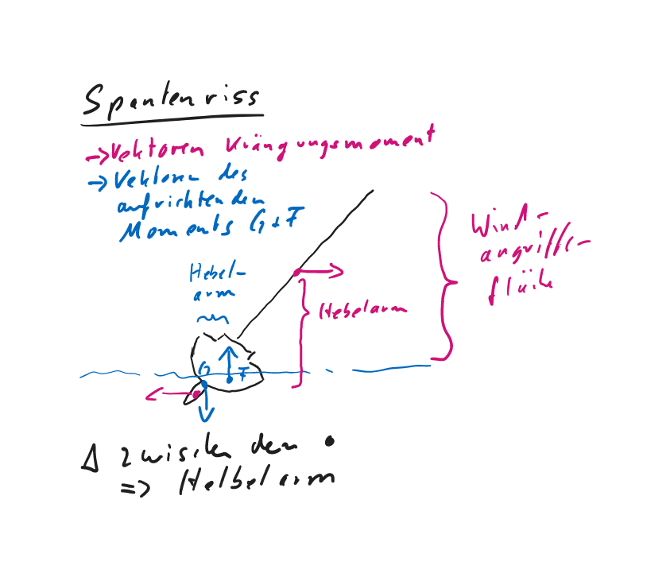

{width=1px height=1px}

# Segelfahrzeug 

1. Wenig große **Segelflächen** sind wirksamer als mehrere kleine. Begrenzt wird dies durch die Reisfestigkeit des Tuches und die Beherrschbarkeit des einzelnen Segels durch Mensch und Mechanik.

2. Die **Düse**, das ist der Spalt zwischen zwei geringfügig überlappenden Segeln, wirkt sich vorteilhaft auf die Strömung der Leeseite aus. => Hintere Teil der Gesamtfläche erhält neue, unverwirbelte Anströmung. =>  verhindert Ablösen des Luftsromes => Vortrieb auf Amwindkurs 

3. Das 7/8- oder das 3/4-Rigg einer **Slup** ermöglicht es, mit dem Achterstag den Mast so zu biegen, dass der Großsegelbauch nach vorn herausgezogen und das Segel flach getrimmt wird. 

4. Bei einer **Yawl** (zusätzlich kleines Segel achtern) steht der Besanmast so weit achtern, damit er einen Hebelarm bildet => Trimmwirkung leichter => Gierigkeit wegtrimmen.

5. Bei einer **Ketsch** (Großegel wird in zwei aufgeteilt) fällt das Besansegel (achtern) kleiner aus => Strömung bei Amwindkursen wird durch Vor- und Großsegel nach innen abgelenkt => Besan wird nur noch in spitzem Winkel angeströmt => geringerer Anteil an Gesamtsegelkraft.

6. **Schoner** (größstes Segel achtern => Schonersegel) => schlechtere Amwindleistung => bessere Raumwind und Vormwindeigenschaften.

7. Moderne **Rollreffanlagen** => Sicherheitsgewinn => Reffen/Bergen aus Cockpit => einfacher und schneller Segelfläche bei veränderter Windstärke anpassen.

8. Für eine besondere **Sturmfock** muss bei vorhandenem Rollvorsegel ein eigenes **Stag** gesetzt werden können. 

>Segel für Fahrtenyacht: Groß, Fock, Genua, Blister und Sturmfock.  
- Bis ca. Bft. 3: Groß und Blister,  
- bis ca. 5 Bft. Groß und Genua,  
- bis ca. 7 Bft. Groß gerefft und Fock,   
- über ca. 7 Bft. Groß (3 * gerefft) und Sturmfock.  

>Bullenstander: Leine von Baumnock zum Vorschiff mit Rolle nach achtern ins Cockpit umgelenkt. Wichtig auf Vorwindkursen, um unfreiwillige Halse (ironisch: „Patenhalse“ ) zu verhindern. Der ausgebaumte Baum wird durch den Bullenstander gesichert.

>Wirkung einer Patenthalse:   
Starkes Anluven des Schiffes auf neuer Seite, Querschlagen, Unfallgefahr für die Mannschaft, sehr starke Belastung im Rigg (Fußblock reißt aus, Wantbruch in Lee, Baum-Stauch in den Mast, ...   
=> Anbringen eines Bullenstanders (Talje von der Baumnock auf das Vorschiff), ...

>Wenn Wind aus der Richtung des Bestimmungshafens kommt:   
Um unter den vorgegebenen Windverhältnissen den Zielhafen zu erreichen, muss man kreuzen. Kreuzen heißt, in bestimmten Zeitabständen abwechselnd mit dem wind von Stb. oder Bb. zu segeln. Segeltechnisch muss demzufolge in ebenso gewissen Zeitabständen eine Wende gefahren werden.

>Begriffe beim Kreuzen:    
- Unter „Holebug“ versteht man den Kurs, auf dem man gegenüber dem Wind an Höhe gewinnt, sich aber dem Bestimmungsort nicht merklich nähert.  
- Auf dem „Streckbug“ verfolgt man den Kurs, auf dem man wenig Höhe gewinnt, aber in Richtung des Zieles Strecke gutmacht, d.h. die Distanz zum Bestimmungshafen merklich verringert.

9. Bedeutung der Crewfühung für das Manövrieren unter Segeln  
Harmonie zwischen Rundergehen und Schotführung:  
- Crew beherrscht Ablauf der Manöver => Jeder einzelne kennt seine Aufgabe      
- Skipper kündigt Manöver an => Crew kann sich vorbereiten   
- Zeittaktangabe mit klaren Kommandos    
- Ausmaßdiktat für Auffieren oder Dichholen

=> Feinfühligeres Manövieren  
=> Optimierung Vortrieb  
=> Unterstützung Anlufen und Abfallen  

10. Tägliche Kontrollen für Betriebssicherheit des Motors:   
- Ölstand    
- Kühlwasserstand   
- Keilriemenspannung  
- Motorbilge   

Nach dem Starten K ontrolle von:  
- Kühlwasseraustritt   
- Öldruck   
- Ladestrom  

11. **Motorproblemlösungen**  
- Kühlwassertemperatur zu hoch: Motor in jeden Fall abstellen  
  - wenn Kühlwasserausstoß funktioniert ist der inner Kreislauf betroffen => evtl. nachfüllen => Sichtkontrolle wo Kühlwasser austritt   
  - wenn Kühlwasserausstoß reduziert => gesamter Seewasserkreislauf kontrollieren => Seewasserfilter reinigen und prüfen (unter Seewasserspiegel halten und prüfen, ob Wasser nachfließt) => kommt kein Wasser => Seeventil oder Außensieb verstopft oder Impeller der Seewasserpumpe beschädigt
  
- Öldruck fällt: Motor unverzüglich abstellen  
  Wenn Ölstand gering => Öl nachfüllen => Motor wieder starten => Ursache für Ölverlust klären => Sichtkontrolle gesamter Motor, Ölkühler, Verbindungsschläuche, Motorbilge
 
- Motor springt nicht an  
  - Batteriestrom zu gering => Umschalten auf Reservebatterie oder Dekompressionshebel der Zylinder öffnen und nacheinandere wieder schließen  
  - Kein Kraftstoff => Stoppzug in Ausgangsstellung

- Motor beleibt stehen:   
  - Kraftstoffmangel (Kurzes Ansteigen, dann Abfallen der Drehzah) => Kraftstoffvorrat prüfen (Bei Schräglage kann letztes 1/4 nicht genutzt werden und zieht Luft => Reservekanister einfüllen => Entlüften => Starten   
  - Luftblase => Entlüften => neu starten
  
12. **Entlüftungsvorgang**  
=> Entlüftungsschrauben (Gehäusedeckel Hauptkraftstofffilter und Einspritzpumpe) öffnen => Handhebel Kraftstoffförderpumpe betätigen => Diesel wird angesaugt und zum Hauptfilter gepumpt => Wenn voll und keine Luft mehr kommt, dann schließen => Weiterpumpen bis aus Einspritzpumpe keine Luft mehr austritt => Entlüftungsschraube schließen

Falls nach dieser Entlüftung der Motor nicht startet, kann man noch die Hochdruckleitungen von der Einspritzpumpe zu den Einspritzdüsen entlüften => Überwurfmuttern an den Einspritzdüsen lockern => Motor mit Anlasser durchdrehen => feiner Dieselstrahl => Muttern festdrehen => neu starten

13. Um unter Motor möglichst **enge Kurven** zu fahren stoppt man erst auf, um beim erneuten Anfahren den Anstrahleffekt zu nutzen.

14. Bei ausgeprägtem Schraubeneffekt nimmt man rückwärts Fahrt auf in dem man voraussehend die Yacht vor dem **Fahrtaufnehmen rückwärts** entsprechend schräg zur vorgesehenen Fahrtrichtung anstellt. 

15. Wenn eine Yacht bei Seitenwind aufgestoppt wird driftet der Bug nach Lee weg => Yacht in den Wind stellen und unter Motor im Wind halten

16. Als schleppendes Fahrzeug wird die eigene Steuerfähigkeit sichergestellt in dem mit einem Stoppersteck ein zweites Tau an der Schlepptrosse angeschlagen wird. Beide Taue werden durch die achterne Lippklampe auf die jeweilige Genuawinsch geführt. 

17. In eine durchhängende Schlepptrosse einzurucken sollte man vermeiden, weil die enstehenden Kräfte unbeherrschbar sind. Manchmal wird versuch so Yachten freizurucken. 

18. **Längsseitsschleppen** bietet sich an, wenn das zuschleppende Fahrzeug in einen engen Hafen bugsiert werden muss. Ist nur bei ruhigem Wasser möglich, da sich die Fender sonst rausarbeiten. 

19. Beim Längsseitsschleppen muss der Schlepper möglichst weit achtern beigetaut werden, damit die Schubrichtung möglichst längsgerichtet ist und nach beiden Seiten Manövrierspielraum lässt.    

20. Bei der Übernahme einer Charteryacht muss man in Erfahrung bringen, ob es sich bei der elektrischen Anlage um eine manuelle (zwei gleichwertige Batterien getrennt und zusammen schaltbar => getrennt entladen und zusammen laden) oder um eine automatische (Start- und Versorgungsbatterie getrennt, mit Versorgungsbatterie kann auch im Notfall gestartet werden => Hauptschalter umlegen) handelt.   

21. Die Batterien einer manuellen Anlage sind beim Motoren zusammenzuschalten so, dass beide geladen werden. Beim Segeln sind sie zu trennen, wegen versehentlichem entladen der Reservebatterie

22. Die Sicherung der Starkstromkreise auf einer Segelyacht findet man üblicherweise im Zuge der Kabelführung.

23. FI-Schalter spüren die geringste Fehlstromabgabe und schalten sofort ab. Eine **220-Volt-Anlage** an Bord bedarf dieser Absicherung direkt hinter dem Stromeingang. 

24. Wichigste regelmäßigen Wartungsarbeiten an der Boardelektrik   
- Säurestand der Batterien prüfen   
- ggf. destiliertes Wasser nachfüllen   
- Kapelkontakte auf festen Sitz prüfen und einfetten   
- Sitz der Batteriebefestigungen nachsehen   
- Einmal im Jahr Schalttafeln abnehmen und Verkabelungen auf festen Sitz und Korrosionsfreiheit prüfen.   
- Kabelverbindungen am Mast einmal jährlich säubern, fetten und Dichtungen kontrollieren    
- Starkstromkontakte am Starter, Ankerwisch, Bugstrahlruder einmaö jährlich säubern, fette und Dichtungen kontrollieren. 

25. **Ladespannung** darf nie 14,3 Volt überschreiten => Batterien fangen sonst an zu kochen => Batterien leiden => explosiver Wasserstoff entsteht. 

26. **Flüssiggasanlagen** an Bord können gefährlich sein. Ausströmendes Gas sammelt sich im Schiff und kann, weil es schwerer als Luft ist, nicht von selbst entweichen. Mit Luft vermischt ist es schon in geringen Mengen explosiv. Außerdem besteht Erstickungsgefahr weil Gas fast doppelt so schwer ist wie Atemluft. 

27. Bei ausströmendem Gas sollte man eingeschaltete elektrische Anlagen nicht ausschalten, weil auch beim Ausschalten elektrische Schaltfunken enstehen können. 

28. Eine Gasanlage wird gemäß DVGW (Deutsche Vereinigung des Gas- und Wasserfachs) nach folgenden Grundsätzen installiert: 

- Gasflasche muss in Raum gestaut sein, der nur von oben zugängich ist, zum Schiffsinneren dicht abgeschlossen und mit einer nach außen führenden Lüftung versehen ist.

- Flasche wird über eine Normanschluss mit verstellbarem Druckregler (50 mbar Ausgangsdruck), Sicherheitsvertil (100 bis 120 mbar Ablassdruck) und Absperrhahn angeschlossen. 

- Vor jedem Verbraucher ist ein Absperrhahn. 

- Brennstellen haben Zündsicherungen.

- Leitungen, Schläuche und Verbindungsstücke sind genormt und tragen Musterprüfzeichen.

29. Erforderliche Überwachungsarbeiten der Gasanlage

- Sicht- und Geruchskontrolle des gesamten Leitungssystems von Zeit zu Zeit.

- Korrosion, Knick- und Scheuerstellen achten

- Schwingbereich des halbkardanisch aufgehängten Herdes überprüfen

- Schläuche dürfen nicht an heiße Teile gelangen

- Dichtheit der Absperrhahne kontrollieren

- Funktion der thermischen Zündsicherungen kontrollieren

30. Schäden an der Gasanlage sollten von einem Fachmann behoben werden. Nach den Vorschriften ist die Gasanlage für Bastler tabu. 

31. Der Skipper sollte für den täglichen Umgang mit der Gasanlage klare Sicheheitsregeln anordnen: 

- Grundsätzlich Absperrhahn an der Flasche nach Gebrauch schließen

- Absperrhähne vor den Geräten bleiben geschlossen, wenn sie nicht gebraucht werden. 

- Wenn Herd in Betrieb => gründliche Belüftung

>Einrichtungen / Sicherheitsvorschriften Flüssiggasanlage/Gaskocheranlage:   
Grundsätzlich muss die Anlage den geltenden Sicherheitsvorschriften entsprechen. Aus diesem Grunde durch autorisierten Fachmann abnehmen lassen. Gasbehälter entweder an Deck oder in einem geschlossenen Raum mit Öffnung in Bodennähe nach außenbords. Meßfühler als Kontrolleinrichtung an einem tiefliegenden Platz in der Bilge montieren, da Flüssiggas schwerer als Luft ist und demzufolge absinkt. Vor Inbetriebnahme Leitungen und Anschlüsse auf Dichtigkeit prüfen. Bei Außerbetriebsetzung alle Absperrventile schließen, möglichst beim Gasbehälter beginnen, dann in der Reihenfolge bis zum Verbraucher.

>Zweck einscheibiger Block der Tagelage (stehendes und laufendes Gut):   
- Der feste, einscheibige Block dient der Richtungsänderung des durchlaufenden Gutes.    
- Die mehrscheibigen Taljen bestehen aus einem mehrscheibigen festen Block und einem mehrscheibigen beweglichen / losen Block, die durch den geschorenen Läufer (Tauwerk) miteinander verbunden sind. Eine Talje dient der Kraftersparnis. Diese hängt ab von der Anzahl Parten am losen / beweglichen Block.

>Wenn bei einer Talje 4 Parten am beweglichen Block angreifen, ist die aufzuwendende Kraft ein Viertel der Last.

# Stabilität 

1. Solange der Formschwerpunkt F weiter in Krängungsrichtung auswandert als der Gewichtsschwerpunkt G, ergibt sich ein aufrichtendes Moment

>Infolge der Neigung wandert der Formschwerpunkt F zur geneigten Seite und bildet nunmehr mit der Wirkungsgeraden des Massenmittelpunktes (Gewichtsschwerpunkt) ein Kräftepaar, das die aufrechte Schwimmlage wieder herstellen will.

2. Das Krängungsmoment nimmt mit zunehmendem Lagewinkel ab => Windangriffsfläche verkleinert sich und Hebelarm (rot) verkleinert sich.  

Krängungsmoment > aufrichtende Moment => Zunahme der Neigung

Krängungsmoment = aufrichtende Moment => **stabile Krängungswinkel** 

Krängungsmoment < aufrichtende Moment => Abnahme der Neigung bis zum stabilen Krängungswinkel

>Dem Krängungsmoment (Winddruck, Wasser[quer]widerstand) wirkt das aufrichtende Moment (Hebelarm aus Auftriebskraft und Gewichtskraft) entgegen.

3. **Stabilität** einer Segelyacht

=> Vermögen, sich gegen auftretende Krängungsmomente bis zu einer bestimmten verbleibenden Schräglage aufzurichten

>Unter „Stabilität“ versteht man das Aufrichtvermögen des Schiffes, falls es gekrängt wird. Oder: Die Stabilität eines Schiffes kennzeichnet seine Eigenschaft, in aufrechter Lage zu schwimmen und einer Krängung aufrichtende Momente entgegenzusetzen.   
Begriffe:   
- u.a. Gewichtsschwerpunkt (Massenmittelpunkt)   
- Formschwerpunkt,   
- Metazentrum,   
- Auftrieb,   
- aufrichtender Hebelarm.  
Die Segelyacht muss sich aus jeder Schwimmlage wieder aufrichten, Gewichtsschwerpunkt muss tiefer als Formschwerpunkt liegen (Ballastkiel!).

>Die Stabilität eines Schiffes wird beeinflusst von     
- seiner Geometrie (Form),   
- seiner Gewichtsverteilung im Schiff (Ausrüstung, Crew, Ballast) und  
- von eventuell von außen wirkenden Störkräften (z.B. Wind, Seegang, Trossenzug).

4. Der **Stabilitätsumfang** einer hochseetauglichen Segelyacht sollte zwischen 90 und 120 Grad liegen 

5. Bauliche Auslegungen

**ranke Yacht** 

=> Gewichtsstabilität => bei Krängung wandert Formschwerpunkt mangels Rumpfbreite nur wenig aus => aufrichtendes Moment steigt nur langsam an => Anfangsstabilität gering => Yacht krängt leicht => früh reffen (Segeltragevermögen gering, weiches Rollverhalten) => Enstabilität groß, weil tief liegende Gewichtsschwerpunkt weit nach Luv auswandert, reicht tief in durchgekenterten Bereich hinein und führt zu einem relativ großen Stabilitätsumfang => gutes Seegangsverhalten (Seetüchtig)

**steife Yachten** 

=> breite Spantform => hoher Anteil an Formstabilität => Bei kleinem Krängungswinkel steigt Kurve des aufrichtenden Moments steil an =>  hohe Anfangsstabilität => hohes Segeltragevermögen => steifes, unangenehmes Rollverhalten => Durch mögliche Segelfläche bessere Amwindeigenschaften => Bei größeren Krängungswinkel verkleinert sich Hebelarm des aufrichtenden Moments => geringe Endstabilität => kleiner Stabilitätsumfang => Regattageeignet 

>Schwerpunkte:    
- Der Flächenschwerpunkt ist der geometrische Schwerpunkt der gesamten Segelfläche.   
- Druckmittelpunkt ist der Punkt, in dem der Druck aller Windkräfte wirkt. Er liegt wegen der Segelwölbung vor dem Flächenschwerpunkt.  
- Der Flächenschwerpunkt der Segel liegt bei Kielbooten ca. 10% der Wasserlinienlänge vor dem Lateralschwerpunkt.   
- Der Lateralschwerpunkt ist der Flächenschwerpunkt des Lateralplanes, in dem der Widerstand gegen Abdrift vorzustellen ist.

# Sicherheitsausrüstung - Handhabung 

>Sicherheitskontrollen bei Übernahme einer Yacht:  
Sicherheitskontrollen bei: Rettungsmittel (Rettungsfloß, (-insel), Westen, Lifebelts), Notsignale, Rettungsring/Rettungsboje, Seeventile, Lenzpumpen, Werkzeug, Motor, Rigg, Anker...

>Sicherheitsausrüstung für persönliche Sicherheit:       
Für jedes Besatzungsmitglied eine Rettungsweste, 1 lifebelt; mindestens ein Rettungsring mit schwimmfähiger Wurfleine (lt. SeeBG: 28 m lang)

1. Methodische Grundsätze bei **Sicherheitseinweisung**  
- Tiefe je nach Vorwissen  
- Evtl. Aufteilen in Gruppen  
- Lernerfolg vor Erledigung  
- **Sicherheitsrollen** vor Beginn der Reise einteilen  
- Rollenzuweisung für alle Notfälle (Maschinenausfall, Ruderausfall, Wassereinbruch, Feuer, Erste Hilfe, MoB, Ausbooten in Rettungsinsel)

>Inhalte Sicherheitseinweisung der gesamten Besatzung vor Reisebeginn:   
Einweisung in Gebrauch und Bedienung   
- der Rettungswesten und Sicherheitsgurte,  
- der Rettungsinsel,   
- der Signalmittel,   
- der Lenzpumpen,   
- der Seeventile und des Bord-WC,   
- der Kocheinrichtung,   
- der Feuerlöscher,   
- der Motoranlage,   
- die Elektroanlage,   
- des Rundfunkgerätes und der UKW-Seefunkstelle,   
- Verhalten bei „MOB“,
- Erkennen und Verhalten bei Seekrankheit. 

>Notrolle "Wassereinbruch":    
Aufteilung auf die Crewmitglieder: Lecksuche Vorschiff/WC, Salon/Pantry, Maschine/Achterschiff, Bedienung Handlenzpumpe, Bedienung elektr. Pumpe, Bereitschaft mit Pütz, Seenotfunkspruch (wenn notwendig).

2. Kontrollen und Wartungsarbeiten der Navigationslichter:  
- Alle Lichter vor Eintritt der Dunkelheit kontrollieren    
- ggf fetten   
- Ersatzlampen und Kabel für Hauptlaternen mitführen  

3. Funktionsprinzip Radarreflektor  
Durch drei jeweils rechtwinklig zueinander stehende Reflektionsflächen wird der Einfallsstrahl genau in Einfallsrichtung zurückgeworfen.  

4. **Yachtstellung** bei der Ausbringung von Radarreflektoren bedeutet, dass zwei Reflexionstrichter voraus und zwei achtern zu richten sind, weil Segelyacht von vorn und von achtern am wenigsten reflektiert wird. 

5. Die **effektive Radarrückstrahlfläche** ist die Maßeinheit für die Reflexionsleistung

6. Grundsätze einer Lenzanlage:  
- Zwei Pumpen (manuell und elektrisch)  
- Die Pumpen saugen am Lenzbrunnen, dem tiefsten Punkt in der Bilge  
- Die Lenzkörbe sind an beweglichen Ansaugschläuchen befestigt (müssen gehoben und gereinigt werden können)  
- Lenzleitung/-Systeme sollten direkt außenbords entleeren  
- Rückschlagventil nur bei Kreiselpumpen nötig, die ventillos arbeiten  
- Rückschlagventil sollte leichtgängig sein  
- Bilge-Disziplin => saubere Bilge  

7. Brandklassen

- A: Brände fester Stoffe, hauptsächlich organischer Natur, mit Glutbildung

- B: Brände von flüssigen oder flüssig werdenden Stoffen

- C: Brände von Gasen

- D: Brände von Leichtmetallen

8. Yachttaugliche **Löschertypen**  
- CO~2-Löscher: Für enge Räume (Motorraum), muss nicht geziehlt auf Brandherd gerichtet werden, ist rückstandsfrei und ungiftig  
- Pulverlöscher: große Löschleistung bei offenen Bränden, schirmt Brandquelle gegen Zuluft ab.  

9. Feuerlöscher haben am besten ihren Bereitschaftsplatz in der Nähe des Niedergangs und zugleich unweit von Maschine (CO~2~ Löscher) und Herd (Feuerlöschdecke). Zweite Löscher für schwerere Fälle (Pulverlöscher) sollte in der Backskiste gestaut sein. 

>ABC-Pulverlöscher für die Anwendung in allen Bereichen, CO2-Löscher für Maschinenraum. Empfehlenswert: mehrere Löscher, auch einer in der Backskiste, damit von allen Seiten bekämpft werden kann (Pantry oft direkt neben dem Niedergang)

>Feuerlöscher:   
- Art: Pulver-, CO2 und Schaumlöscher nach den jeweiligen Brandklassen.  
ABC-Feuerlöscher für Brandklassen A (feste Stoffe brennen), B(flüssige oder flüssig werdende Stoffe brennen) und C (Gase brennen)   
CO2-Feuerlöscher nur für geschlossene Motorräume mit spezieller Löschöffnung verwenden. Lagerung nur so, dass austretendes CO~2~ (schwerer als Luft!) nicht ins Schiff strömen kann (Erstickungsgefahr)   
- Aufstellung: Sichtbar oder mit entsprechendem Hinweisschild versehen, frei zugänglich.   
- Wartung: Auf Einhaltung der vorgeschriebenen Wartungsintervalle achten bzw. bei Druckverlust und nach Benutzung sofort wieder auffüllen bzw. auffüllen lassen.

10. Feuerlöscher in den vorgeschriebenen Zeitabständen (meistens 2 Jahre) zur Inspektion vorführen.

11. Den Löschstrahl richtet man auf die Brandquelle, also das brennende Material und nicht die Flammen. Luftzufuhr vermeiden, bei Motorbrand wenn möglich Löschöffnung verwenden. 

12. Die Boardapotheke sollte nach folgenden Richtlinien ausgesattet sein:  
- Fahrbereich  
- Anzahl Crewmittglieder  
- Dauer der Reise  
- Gesundheitszustand Besatzungsmitglieder  
- Alter der Besatzugnsmitglieder  
- medizinische Vorbildung unter der Besatzung  

13. Das Nummernverzeichnis im Zusammenhang mit der empfohlenen Inhaltsliste kann ein Sportschiffer als Anhalt für die Ausstattung mit Medikamenten und Heilmitteln nehmen. 

14. Seenotsignalmittel sind in unverschlossenem Zustand und vor Feuchtigkeit geschützt in Bereitschaft zu halten.

15. Sicherstellung der Handhabung im Einsatzfall durch  
- allgemeine Sicherheitseinweisung   
- Studium der Gebrauchsanweisung aller Mittel durch alle Crewmitglieder 

=> Einsatz nur durch Anordnung des Schiffsführers

16. Besonderes Werkzeug für die Leckbekämpfung und für Bruch im Rigg gehören griffbereit, wohlkonserviert und funktionsklar in einen eigenen Kasten **Bruch und Leck**  
- Für Lecks: Rundstopfen, Dichtungsmaterial (aufblasbare Gummikissen und Plastikbandagen), scharfe kurzstilige Axt, Stichsäge, Stechbeitel, Holzkeile.  
- Für Bruch im Rigg: Niro schneidende Säge, Wantenschneideappart, Drahtseilbügelklemmen verschiedener Größe

17. **Sicherheitsgurte und -leinen** müssen einen hohe Reisfestigkeit haben (2 Tonnen), dass sie das harte Einrucken bei einem freien Fall in der gesamten Länge aushalten => max 2 M lang => Sorgleine besser mit halber Länge einpiken.

18. Eine moderne Automatik-Sicherungsweste funktioniert mit Hilfe einer wasserlöslichen Tablette. Diese blockiert einen federspannenden Bolzen. Bei Wasserkontakt (durch z. B. Eintauchen in Wasser) löst sich die Sperre innerhalb von Sekunden, und der Schlagbolzen schlägt die Öffnung in die keine Druckflasche. Aus der strömt dann das Kohlendioxis in die Schwimmkörper. Es gibt noch einen Nachblaseschlauch und eine Signalpfeife. 

Die Ohnmachtssicherheit wird durch die übergroßen Brustschwimmkörper im Gleichgewicht mit dem Nackenkissen gewährleistet.  

19. Der **Schiffsführer entscheidet** für die ganze Crew verbindlich, wann Sicherheitsgurte und Rettungswesten getragen werden. Seine Entscheidung richtet sich nach Wetter und Seegang. 

Faustregeln (für Tragen von beidem):  
- Sobald Wasser über's Deck kommt   
- nachts   
- bei sichtigem Wetter  

=> Abhängig von Größe und Seeverhalten der Yacht, Routiniertheit und körperliche Verfassung der Crew  

>Anforderungen an Rettungswesten:   
Für jede Person muss eine ohnmachtssichere Rettungsweste an Bord sein. Rettungsweste dreht Person automatisch in die ohnmachtssichere Rückenlage. Rettungswesten gut zugänglich lagern! Nach Möglichkeit immer tragen; Kinder auch im Hafen! Anlegen der Rettungsweste üben. Kinder im Sommer mit angelegter Rettungsweste baden lassen (=vertrauensbildende Maßnahme). Feststoffweste: Wenn von SeeBG zugelassen, dann absolut sicher: schlechter Tragekomfort. Besser aufblasbare Weste mit Automatik. Handauslösung und Mundaufblasung mit integriertem Sicherheitsgurt. Großer Tragekomfort, aber rettet Ohnmächtigen nur, wenn Automatik nicht versagt. An jeder Weste soll eine Doppeltonsignalpfeife angebändselt sein. Doppelton!, kann mit Möwenschrei nicht verwechselt werden.
Reflexfolien auf Westen kleben!

>Anforderungen an Rettungsweste:   
Die Rettungsweste muss eine ausreichende, ohnmachtsichere Tragfähigkeit haben, insgesamt bequem am Körper sitzen und größenmäßig passen, eine gut erkennbare Farbe mit Reflexionsstoff haben. Eine zuverlässige und leicht bedienbare Aufblasvorrichtung muss vorhanden sein, sie muss ausgerüstet sein mit einer Trillerpfeife und einer bedienbaren Leuchtvorrichtung für eine Brenndauer von 8 Stunden (lt. SeeBG)

20. Einpicken mit Sicherheitsleine

- Im Cockpit: Augenbolzen in außreichender Anzahl im Cockpit

- Auf dem Weg nach vorne: Strecktaue (Jackstagen) in beiden Wassergängen

- Bei Arbeiten am Mast: Augenbolzen in Höhe das Baums

21. Rettungsmittelempfehlungen der Kreuzer-Abteilung für MOB

- Geschützte Reviere und Küstengewässer: Einen ohnmachtssicherer Feststoffschwimmkörper mit 20m Schwimmleine   
- Außerhalb Küstengewässer: Zwei ohnmachtssichere Feststoffschwimmkörper, einer mit Markierungsboje und einer mit 20m Schwimmleine   
- Alle Fahrtengebiete: 15 bis 25 m lange Schwimmfähige Wurfleine mit Wurfgewicht und geeigenter Bergeeinrichtung

22. Rettungskragen und Markierungboje sind so am Heckkorb zu befestigen, dass man sie mit **zwei Griffen** (weil gegen überkommendes Wasser geschützt) entnehmen und über Bord werfen kann.

23. Am Ende der Wurfleine sollte der zweite Rettungskragen und ein Kiessäckchen als Wurfgewicht befestigt sein. Man wirft den so beschwerten Rettungskragen mit freiem Schwung, die Leine wird im Flug ausgezogen. 

24. Hochseeyacht muss mit einer Rettungsinsel (Rettungsfloß) ausgerüstet sein, dass die **gesamte Besatzung** aufzunehmen vermag. 

25. Eigenschaften Rettungsfloß  
- In Behälter oder Tasche gepackt und schwimmfähig  
- darf im Seegang nicht kentern  
- Dach mit Schutz vor Naturgewalten  
- Aufrichtbar aus Überkopflage durch eine Person  
- Einstiegshilfe vor Eingang  
- Separate Luftkammern, von denen die Hälfte notfalls ausreichen  
- wärmeisolierender Boden

26. Ausrüstung der Rettungsflöße nach den Sicherheitsrichtlinien:  
- schwimmender Rettungswurfring ab 30 m Schwimmleine  
- Sicherheitsmesser, Taschenlampe, Ösfass, zwei Schwämme  
- 2 Paddel    
- um 90 Grad von der Einstiegsseite versetzter Treibanker  
- Flickzeug, Blasebalg   
- 3 rote Handnotfackeln   
- Tabletten gegen Seekrankheit (6 pro Person)   
- Anweisung für das Überleben auf dem Rettungsfloß

27. Inhalt einer zusätzliche empfohlenen Nottasche:  
- zwei Treibanker mit Leine  
- nicht dursterregende Lebensmittelrationen, zwei Sicherheitsdosenöffner  
- Frischwasser (min. 0,4 L pro Person), Trinkbecher mit Messeinteilung  
- Erste-Hilfe-Kasten  
- alle verbliebenen Seenotsignalmittel  
- Tagessignalspiegel, Signalpfeife  
- Tafel mit den Lebensrettungssignalen  
- Nylongarn und Plastiktüten  
- tragbares Sprechfunkgerät, Mobiltelefone, EPIRB, SAR-Transponder  
- Logbuch, Schiffspapiere (nicht teil des ORC-Katalogs (Offshore Racing Council))

> Seenotfunkbake EPIRB (Emergency position-Indicating radiobeacon station):   
- Cospas-Sarsat-Bake 406 Mhz (enthält Code und Identifizierungs-Nr.), Position wird mit Dopplereffekt vom Satelliten aus gemessen (auf ca. 5 km genau), bei neueren Geräten ist ein GPS integriert, sodass die GPSPosition mitgesendet wird. Die Seenotbake sendet auch auf der Notfrequenz 121,5 Mhz der Luftfahrt, somit können Rettungsboote, Rettungsflieger und -hubschrauber die Bake im Nahbereich (bis 20sm Entfernung) peilen. Die Alarmverzögerung kann im ungünstigen Fall einige Stunden dauern.  
- Eine Inmarsat-E Bake sendet im L-Band (1,6Ghz), ist mit GPS-Empfänger ausgerüstet, sendet so auch exakte Position. Die Alarmverzögerung beträgt maximal 2 Minuten. Die Bake funktioniert nut in der Abdeckung von Inmarsat zwischen etwa 70Grad Nord und 70Grad Süd.
- Beide Baken können per Hand ausgelöst werden, lösen sich aber auch automatisch z.B. bei Untergang des Schiffes aus.

28. **Vorbereitung zum Ausbooten**:  
- Sicherheitsrollen bei Einweisung  
- Position feststellen und Überprüfung durch zweite geeignete Person   
- Notmeldung abgeben   
- Nottasche packen   
- Rettungsfloß an Reling wuchten   
- Überprüfung der Verknotung der Sorg- und Auslöseleine  

=> Ausbooten nur auf Anweisung des Schiffsführers

29. Auf **Anordnung** wird das Floß nach Lee über Bord gebracht und kräftig an der Sorgeleine gerissen, bis sich der Behälter öffnet. Sollte das Floß kieloben liegen, muss jemand angeleint ins Wasser und das Floß **aufrichten** => Richtige Seite ist mit Symbolen und und vielen Sprachen gekennzeichnet. 

Zum **Übersteiegn** lässt man sich angeleint bäuchlings auf das Dach fallen und krabbelt in die Öffnung => Sorgeleine für den Nächsten lösen => mit den anderen zusammenpicken

# Seetüchtigkeit 

1. Beim Erwerb einer Yacht kann deren Tauglichkeit durch eine **CE-Kennzeichnung** bescheinigt werden. Danach müssen Hersteller nach einem vorgeschriebenen Prüfverfahren nachweisen, für welche Belastung ein Fahrzeug Sicherheit gewährt.  

2. CE-Kennzeichnung Auslegungskategorie A bedeutet für Hochsee ausgelegt, d. h. über 8 Bft und über 4 m Wellenhöhe. 

3. Der Begriff Klassifikation bedeute im Zusammenhang mit der Tauglichkeit eines Schiffes das Außmaß der Belastung. 

4.  Die **Sicherheitsrichtlinien der Kreuzer-Abteilung** gilt als anerkannte Leitlinie bei Ausstattung einer Yacht mit Sicherheitsausrüstung.

>Veröffentlichungen zu Richtlinien über Sicherheitsmaßnahmen und Ausrüstungsvorschriften an Bord von Yachten:  
- Sicherheitsrichtlinien der Kreuzerabteilung des DSV   
- Vorsichtsmaßregeln für Wassersportler    
- Broschüre: Sicherheit in der Sportschiffahrt im See- und Küstenbereich vom BSH   
- Unfallverhütungsvorschriften  
- Küsten Almanach

5. Nur wenn man allabendlich einen Hafen oder eine Ankerbucht anlaufen kann, ist ein **Ein-Wachen-System** zu verantworten.

6. Unter geeigneten Mitgliedern einer Besatzung sind solche zu verstehen, die unter der knappen Anleitung mit den üblichen Kommandos ihren Part beim Manöver selbständig übernehmen können.

7. Werden längere Strecken auf See verbracht, ist ein **Mehr-Wachen-System** (mindestens zwei) erforderlich.

8. Die Anzahl Tage für die verproviantiert wird, richtet sich nach der Segelzeit bis zur nächsten **Einkaufsmöglichkeit**.

9. Bei den veranschlagten **Etmalen** ist von einer vernünftigen Durchschnittssegelleistung auszugehen, einschließlich der Großwetterlage angemessenen Sicherheitsabzugs für Schwachwindzonen und für Kreuzstrecken. Aufgrund des Motors auf eine höhere Streckenleistung zu setzen, gilt zunächst nur im Falle von zu schwachem Wind. 

10. Das Stauproblem bekommt man am besten in den Griff mit einer durchdachten **Stauordnung** bezgl. Gewicht, Verderblichkeit und Wiederfinden. => Besonderer Bereich für angebrochene Gebinde => Verantwortung durch einen Mitsegler.

11. Segelunternehmung den gegebenen Grenzen der Seetüchtigkeit von Schiff und Besatzung anpassen durch:   
- Beschränkung auf geschützte Reviere  
- Vermeidung von Schwerwetterperioden  
- Wahl einer Route mit genügend Ausweichmöglichkeiten  
- Rückgriff auf besonders erfahrene Besatzungsmitglieder  
- Wahl einer besonders gut handhabbaren Yacht   
- Vermeidung enger Zeitpläne   
- Zusammenbleiben mit anderen Yachten

>Das Schiff muss für einen seetüchtigen Zustand gehörig eingerichtet, ausgerüstet, bemannt und verproviantiert sein, so dass die bevorstehende Reise ohne Bedenken angetreten werden kann.   
Verantwortlich für die Seetüchtigkeit zu Beginn der Reise ist der Schiffsführer.

# Verhalten in Notfällen 

1. Löschen von Enstehungsbränden bei   
- ausströhmendem Gas: Abstellhahn zudrehen => ggf. Löschen von Sekundärbränden   
- Kabelbrand: Motor abstellen => Batteriehauptschalter ausstellen   
- Feuer im Maschinenraum:  Luftzufuhr unterbinden => Motor abstellen (Kraftstoffdruck und Lüfter wird dadurch deaktiviert) => CO~2 Löscher oder Pulverlöscher in Feuerlöschöffnung entleeren

>Wirksame Bekämpfung von Bränden an Bord:   
- Alle Öffnungen schließen,  
- Brennstoffzufuhr (Hauptschalter) unterbrechen,  
- Feuerlöscher erst am Brandherd betätigen,  
- Feuer von unten und von vorn bekämpfen,  
- Löschdecke einsetzen,
- Flüssigkeitsbrände und Brände in der elektrischen Anlage nicht mit Wasser bekämpfen.

2. Sobald erkennbar wird, dass sich ein Feuer trotz Löschbemühungen ausweitet, muss der Skipper die **Sicherheitsrolle Rettungsfloß** starten.

3. Wenn inmitten von Schiffsverkehr bei Flaute der Motor ausfällt, ist das Signal für **Manövrierunfähigkeit** zu setzen. Es ist jeder Versuch zu unternehmen, aus Bereichen dichten Verkehrs hinauszugelangen. => **Sicherheitsmeldung an alle**

Wenn keine Schlepphilfe in Sicht, weil z. B. Nacht:   
- Größere Yachten können ihr motorisiertes Beibot als Schlepper ausbringen.  
- Kleiner Yachten können Wriggen (Fortbewegen eines Bootes mittels nur eines, mittig nach hinten gerichteten Ruders (Riemens) oder Paddeln.  

4. Wenn in einem **engen Kanal** bei vorlichem Wind die Maschine ausfällt, sollte man sofort, unter Ausnutzung des Restschwungs, auf Gegenkurs gehen. 

5. Für den Fall des **Motorausfalls bei Hafenmanövern** sollte der umsichtige Schiffsführer den **Anker klarmachen** zum Fallen. Die **Segel klar zum Setzen** zu haben, ist für kleinere Yachten eine sekundäre sinnvolle Sicherheitsmaßnahme.

6. Beim Hafenmanöver bricht einer der **Steuerzüge** für Gas oder Getriebe => aus Hindernisbereich mit besteheder Leistung heraussteuern => Maschinengast (Sicherheitsrolle) muss nach unten => Motorabdeckung öffnen => Gashebel an der Einspritzpumpe oder den Schalthebel am Getriebe nach Maschinenkommandos betätigen. 

Passiert das bei Aufstoppen => Hartruder und Stoppzug

7. Das **Steuern mit der Notpinne** erleichtern => Fahrt herabsetzen und angnehmen Kurs zum Wind fahren. 

Die meisten Yachten lassen sich vom Amwind- bis Halbwindkurs völlig ohne Ruder nur **durch die Segelsteuerung steuern** => Vorsegel auf optimalen Vortrieb trimmen => steuern mit Großsegel oder Besan 

- Dichtholen => Anluven   
- Fieren=> Abfallen

Reicht das nicht aus => Vorsegel gegenläufig zur Hilfe nehmen. 

8. Wenn die Notpinne nicht die Steuerfähigkeit zurückgibt muss man versuche, das **Ruderblatt direkt** zu bewegen. => wenn vorhanden, achternes Loch oben am Ruderblatt vertauen und damit steuern => alternativ anders vertauen

9. Verhaltensgrundätze bei Schlepphilfe:   
- ständige Zeichen-, Ruf- oder Funkverbindung mit dem Schlepper   
- kräftige Befestigung der Schleppleine an Deck mit Möglichkeit zum Loswerfen unter Zug   
- Schleppleine durch die Bugklüse oder Lippklampe führen, Schamfilkontrollen in kurzen Abständen   
- Schlepptrosse möglichst lang und elastisch und auf Länge der See abgestimmt   
- Verletzungsgefahr bei Bruch der Schlepptrosse beachten   
- energisch Kurs halten, notfalls Kurs mit Bremsschleppen stabilisieren  

10. Reflexhandlung, falls die Steuerung im Gefahrenbereich von Hindernissen oder bei Hafenmanövern ausfällt => **Maschine voll zurück** => Anker fallen lassen

11. Bricht das Want oder der Stag unter großem Winddruck, dürfte auch mit einem Entlastungsmanöver der Mast nicht mehr zu halten sein. 

12. Gebrochenes Stahdrahttauwerk (Wanten oder Stagen) repariert man oder ersetzt sie durch Fallen => Verbindungen werden mit Augen herstellen, die man mit Drahtseilklemmen steckt. 

13. Ein gebrochenes Großfall ersetzt man mit der Dirk. 

14. Ablauf der Sicherheitsrolle Wassereinbruch => **all hands Manöver**  
- Alle sofort aus der Koje   
- Lenzpumpen einschalten   
- Handpumpen bemannen   
- Pütz einsetzen   
- Rest der Crew zugewiesene Suchbereiche inspizieren => Bodenplatten abheben => Seewasserführende Rohre und Schläche und Schiffsboden und Bordwand inspizieren => von unten nach oben arbeiten => Toiletten, Kettenkasten, Lukerschlüsse, Relingstützbereich, Backkisten, Ruderbereich 

15. praktische Lecksicherungsmethoden    

- von innen     
   - gebrochene Rohre und Schläche: Seeventile dichtdrehen oder Leckstelle bandagieren   
   - fehlende Seeventile (Loggeber, Cockpitlenzer): Rundstopfen einschlagen   
   - Bruch der Schiffswand: Platz verschaffen mit Brechwerkzeug und Säge => Gummikissen oder Kissen mit Plastiküberzug gegen die Wand drücken => Mit einer Platte in Position halten => Verkeilen mit Einrichtungsgegenständen => Lücken mit Lappen verschließen  
- von außen      
Lecksegel (Arbeitsfock) von vorn unter den Bug stülpen => Schothorn am Bugbeschlag befestigen => Segel vor dem Bug ins Wasser werfen => mit zwei Personen an Kopf und Hals hin nach achtern ziehen => Segel plan über die Leckstelle bekommen. 

> Leck im Vorschiff, weil Tonne gerammt: 
Sofort auf den anderen Bug gehen, das Loch liegt jetzt oberhalb der Wasserlinie! Es ist zu überprüfen, ob das Leck von innen her dicht zu setzen ist. Dieses ist oft nur möglich, wenn der Innenausbau in diesem Bereich beseitigt wird. Evt. kann aber mit einem Kissen oder Holzpallen das Loch soweit abgedichtet werden, dass man Hafen erreichen kann, auch wenn die ganze Zeit gelenzt werden muss. Zusätzlich könnte man eine kleine Fock mit Schothorn und Hals an der Reelingsschiene (Fußleiste) befestigen. Am Kopf in den Reserveanker angeschäkeln und eine Leine befestigen, damit das Segel unter Wasser taucht. Mit dieser Leine holt man nun auf der nicht beschäfigten Seite den Kopf des Segels hoch und hat damit ein Lecksegel geriggt. Im Zubehörhandel kann man einen sogenannten Leckschirm käuflich erwerben. Man schiebt diesen von innen nach außen und öffnet ihn dann. Der Wasserdruck presst das Lecksegel gegen die Bordwand. Um den Schirm einsetzen zu können, muss freier Zugang von innen her zum Leck möglich sein.
  
16. Bei einer Grundberührung versuch man das **Festkommen zu verhindern** durch schnelle Reaktion => Hart Ruder in die Richtung wo man das tiefere Wasser vermutet (oder hart abfallen) => Motor starten und Segel dichtholen => Schiff kränkt und Kiel wird angehoben. 

17. Sicherheits-Checks nach einer Grundberührung  
- Bilge und insbesondere **Kielaufhängung kontrollieren**   
- **Motoraufhängung** kontrollieren (Neigung bei Drehmoment)
 
18. Freischleppmanöver funktionieren nach dem Prinzip, dass durch Kränkung der Kiel angehoben wird. 

19. Zum Freischleppen kann ein helfendes Motorboot den Masttop mit dem Spifall zur Seite ziehen. 

20. Wenn man in Gezeitengewässern festkommt, wartet man den höheren Wasserstand ab. Der Anker ist in jedem Fall zum tiefen Wasser hin auszubringen, um zuverhindern, das bei auflaufendem Wasser die Yacht weiter bergauf geschoben wird. 

21. Bei einer Strandung sollten der Küstenabschnitt ohne Hindernisse sein:  
- Keine vorgelagerten Felsformationen (Steine unter Wasser)  
- Keine Brandungswellen   
- Brandungszone nicht zu schmal   
- Grund sollte nicht zu steil abfallen 

22. Strandung

Vorbereitung der Strandung an Bord:   
- Crew aufklären   
- Crew sollte sich im Cockpit aufhalten und sich mit Händen und Füßen verkeilen   
- Nicht in Sicherheitsleine einpiken   
- Schlauchboot oder Rettungsinsel ausbringen   
- Alle verfügbaren Festmacher, Schleppleinen und Schoten sind zu einer langen Vorleine zusammenzustecken und auf dem Vorschiff anzuschlagen   
- Niedergang und alle Lucken dichmachen   

Ablauf des Strandungsmanövers:   
- Start ist die slippende Ankerposition   
- **Fock setzen**   
- Ankerkette bzw. **Ankertrosse kappen**   
- unter Fock fällt die Yacht ab   
- Fahrt aufnehmen und **vierkant zu den Wellen** steuern    
- hindernissfreie Stelle am Strand **mit ungehemmter Fahrt** anlaufen   
- **hoch aufgleiten**, dass die Yacht möglichst fest liegen bleibt und nicht angehoben und quergedreht werden kann. 

# Kollision 

1. Von der **Beistandspflicht** kann abgesehen werden, wenn durch die Hilfsmaßnahmen das eigene Schiff und die Besatzung in unvertretbarem Maße gefährdet würden. Es gilt das Prinzip der Angemessenheit. 

2. Maßnahmen zur Sicherung der Unfallstelle in verkehrsreichem Gebiet:   
- Die Schiffahrt über Funk mit wiederholten Sicherheitsmeldungen vor dem Schiffshinderniss warnen.     
- Über die Küstenfunkstelle oder den Revierfunkdienst ist das zuständige Wasser- und Schiffahrtsamt zu informieren.    
- Bei Schiffen über 12m sind die Lichter und Signalkörper manövrierunfähiger Fahrzeugenzu setzen (zwei schwarze Bälle oder zwei rote Rundumlichter)    
- Bei unsichtigem Wetter sind Schallsignale für manövrierunfähige Schiffe (lang-kurz-lang) zu geben.

3. Wenn eines der Schiffe zu sinken droht, so ist das bedrohte Schiff aus eigener Kraft und mit Hilfe des anderen Schiffes aus dem Fahrwasser heraus und möglichst auf flachen Grund zu bugsieren.

4. Die beiden Schiffsführer tauschen für spätere Regelung der Haftung folgende Informationen aus:   
- Schiffsname und Unterscheidungssignal  
- Heimathafen  
- Bestimmungshafen  
- Name und Adresse des Schiffsführers  
- Name und Adresse Reeder/Eigner  
- Bezeichnung und Nummer der Haftpflichtversicherung  
- Beobachtung des Unfallhergangs verschriftlichen und gegenzeichnen

5. Maßnahmen zur **Beweissicherung**:  
- Möglichst viele Anhaltspunkte sammeln   
- Standort genau vermessen und festhalten   
- letzter Kurs und Peilung des anderen Schiffes bei Annäherung notieren   
- Namen und Funkstationen der Mitglieder der Seewache und mögliche besondere Anweisungen, die zur Zeit der Kollision galten, sind aufzuschreiben   
- Schäden an beiden Schiffen fotografieren und skizzieren   
- Alle o. g. Informationen im Logbuch festhalten   
- Auf getrennte Zeichnungen und Fotografien ist im Logbuch hinzuweisen  

6. Anzeige zu erstatten ist  
- dem zuständigen Wasser- und Schiffahrtsamt  
- der eigenen Versicherung  
- der Bundesanstallt für Seeunfalluntersuchung

# Seenotfall 
  
1. Seenotfall unterscheidet sich vom Notfall im Betrieb einer Yacht da der Seenotfall eine besondere Situation ist, **in der eine echte Gefahr für Schiff oder Besatzung besteht und fremde Hilfe zur Abwendung dieser Gefahr erforderlich ist**.

2. Hilfe ist anzufordern mit den in der KVR **vorgeschriebenen Notzeichen**, am besten jedoch über Funk.

3. Nach Aufnahme des Funkkontakts sind dem Hilfeleistenden folgende Informationen zu übermitteln:  
- Name  
- Position  
- Art der benötigten Hilfe  
- Zustand des Fahrzeugs und der Besatzung  
- Kurs und Geschwindigkeit zu einem gegebenenfalls verinbarten Treffpunkt  
- Wetter im Seegebiet  
- Einzelheiten, die das Erkennen des Fahrzeugs erleichter

4. **Vorbereitung zum Ausbooten in Rettungsfloß**:  
- Sicherheitsrollen bei Einweisung  
- Position feststellen und Überprüfung durch zweite geeignete Person  
- Notmeldung abgeben  
- Nottasche packen  
- Rettungsfloß an Reling wuchten
- Überprüfung der Verknotung der Sorg- und Auslöseleine 

=> Ausbooten nur auf Anweisung des Schiffsführers

5. Der Schiffsführer muss den natürlichen Drang der Crew bedenken, das Schiff zu früh verlassen zu wollen. 

6. Um einen **geordneten Ablauf** der anstehenden Handlungen zu gewährleisten, besteht der Schiffsführer auf der Aufgabenverteilung nach den vorbereiteten **Sicherheitsrollen**.

>Maßnahmen bei Eintritt eines Seenotfalles, mit Möglichkeit die Yacht verlassern zu müssen:   
- Boot auf keinen Fall zu früh verlassen   
- Schiffsführer muss klare, eindeutige Weisungen erteilen und so einer evtl. entstehenden Panikstimmung an Bord entgegenwirken   
- Meldung über Seenotsituation abgeben   
- Seenotsignalmittel klarlegen und ggfs. bei in Sicht kommen von anderen Schiffen bzw. Hubschraubern/Suchflugzeugen anwenden    
- der Befehl zum Verlassen des Bootes wird grundsätzlich nur vom Bootsführer gegeben   
- vor dem Verlassen der Yacht reichlich wärmende Kleidung anziehen, an Hand- und Fußgelenken zubinden, um Wasserzirkulation und damit Wärmeverlust zu verhindern   
- vor dem Verlassen des Schiffes Lebensmittel und reichlich Flüssigkeit zu sich nehmen   
- besondere Sorgfalt beim Aussetzen der Rettungsinsel verwenden, damit diese nicht vor dem Bemannen abtreibt.

>Maßnahmen an Bord bei Seenotfall laut Broschüre "Sicherheit im See- und Küstenbereich Sorgfaltsregeln für Wassersportler":   
- Rettungswesten anlegen   
- So lange wie möglich an Bord bleiben.   
- Nicht rauchen, keinen Alkohol zu sich nehmen.   
- Mit vorgeschriebenen Notzeichen Hilfe anfordern.   
- Angabe machen über Zustand des Fahrzeugs und der Besatzung, Kurs und Geschwindigkeit, Wetter in dem betreffenden Seegebiet Einzelheiten über das Erkennen des Fahrzeugs.

>Maßnahmen bei Verlassen der Yacht laut Broschüre "Sicherheit im See- und Küstenbereich Sorgfaltsregeln für Wassersportler":   
- Möglicht viel (warme gesüßte) Flüssigkeit zu sich nehmen.   
- Vor dem Vonbordgehen enganliegende wärmende Kleidung anziehen (möglichst reichlich, mit Schuhen und Handschuhen).  
- Falls Überlebensfahrzeug vorhanden (Boot, Floß), Decken, Lebensmittel mit Getränken, Erste-HilfeVerbandskasten, Sprechfunkgerät, Notsender usw. in dieses Fahrzeug geben.  
- Möglichst rot-weiß-farbige oder orangefarbige Gegenstände nach außenbords werfen, da diese aus der Luft gut auszumachen sind.  
- Man sollte versuchen, möglicht trocken in ein Rettungsfahrzeug zu kommen.   
- Nicht auf ein (bemanntes) Rettungsfloß springen.   
- Ggf. mit angezogenen Beinen und Festhalten der Rettungsweste (mit beiden Händen) ins Wasser springen.

>Einsatz einer Rettungsinsel von einer Yacht aus:   
Solange wie möglich an Bord bleiben! Schiffe sind zäher als man denkt. Yacht nur auf Anweisung des Schiffsführers verlassen. Oft wird die Rettungsinsel während der Hafenliegezeit gesichert ( Kette/Schloss ). Vor dem Auslaufen ist die Rettungsinsel zu entsichern. Vor den Überbordwerfen Reißleine an Bord befestigen. Dann an der Reißleine ziehen, bis die Insel sich öffnet. Einsteigen: Man springt bäuchlings auf das Dach und krabbelt in die Insel. Sich innen so platzieren, dass man als Kontergewicht dient, wenn der nächste auf das Dach springt. Das Einsteigen vom Wasser her ist nicht einfach. Die bereits in der Insel sich aufhaltenden Personen müssen helfen.
Letztendlich die Leine zur Yacht lösen.

7. Um sich im Sinne des Überlebens einzurichten ist nach dem Aussteigen in das **Rettungsfloß** das **Verhalten** wie folgt zu regeln:  
- **Ausrüstung** begutachten und sichern  
- Innenraum **trockenösen** und unnötige **Auskühlung** vorbeugen  
- **Treibrichtung** quer zur Einstiegsöffnung durch Treibanker kontrollieren  
- Einstieg wegen **Seekrankheit** offenhalten und Medikamente dagegen ausgeben  
- Alle 10 Minuten **Horizont** nach Schiffsverkehr absuchen  
- **Seenotsignale** nur abfeuern, wenn im vorlichen Halbsektor von nahenden Schiffen  
- Nur nachts Fallschirmrakten (10-20sm erkennbar) mit **zwei Schuss** in ca. 30 Sec. Abstand abfeuern (Alarmierung und Peilung)  
- Bei Sonne jedes herannahende Schiff mit **Tagessignalspiegel** anblicken
- Mit Handsprechfunkgerät von Zeit zu Zeit **Notfrequenz abhören**. Nur senden, wenn Schiff in Sicht, wegen Sendeleistung  
- **Trinkwasser und Verpflegung** rationieren und Regeln penibel einhalten => Min. 0,4 L pro Person/Tag

8. Alle 10 Minuten **Horizont** nach Schiffsverkehr absuchen 

9. Nur nachts Fallschirmrakten (10-20sm erkennbar) mit **zwei Schuss** in ca. 30 Sec. Abstand abfeuern (Alarmierung und Peilung) 

10. **Trinwasser und Verpflegung** rationieren und Regeln penibel einhalten => Min. 0,4 L pro Person/Tat

11. Verhaltensweisen nach BSH für Schiffbrüchige, die im Wasser treiben:  
- So lange wie möglich an Bord bleiben  
- Alle Kleidung und Schuhe anbehalten  
- ruhige Körperlage, nicht schwimmen  
- Zusammenbleiben, Körperkontakt mit anderen halten, um den Wärmestrom zu verringern  
- Atmungsöffnungen vor Spritzwasser schützen  
- Nachts oder bei schlechter Sicht sich mit Signalpfeife bemerkbar machen und um ein schwimmfähiges Rettungslicht sammeln  
- Nicht versuchen eine sichtbare Küste schwimmend zu erreichen (Strandnähe ausgenommen)

12. **Im Seegang** arbeitet sich der Rettungskreuzer mit dem Bug von Lee achtern an den Havaristen heran, von wo ein Decksmann versucht eine Leine überzuwerfen. Mit ihr können weitere Leinen zum abbergen von Personen oder auch die Schlepptrosse übergebracht werden.  

13. Hauptgefahr beim Abbergen von Personen durch ein Frachtschiff liegt im **schlagenden Mast** => Abstand halten

14. Frachtschiffe können bei schwerer See Hilfe leisten indem sie sich in Luv quer vor den Havaristen legen. Mit Funk des GMDSS kann weitere Hilfe angefordert werden (z. B. Hubschrauber). 

15. Vorbereitungen einer Yacht zum Abbergen durch einen Hubschrauber:   
- Während Anflug per **Sprechfunkverkehr** die Lage und das Abbergeverfahren absprechen  
- **Segel bergen**  
- **Treibanker** über Bug ausbringen  
- **Abbergebereit** auf dem Achterschiff versammeln  

16. Die Rettungsschlinge wird mit dem Verschluss nach vorne über den Kopf und Arme gestülpt, sodass die **unter den Achseln** trägt. Es ist unbedingt darauf zu achten, dass das Kabel direkt ins Wasser hängt und nicht irgendwo **hinterhakt**. Auf Zeichen "Daumen nach oben" taut der Hubschrauber an und zieht die Person in der Schlinge **schräg seitlich vom Achterstag weg** nach oben. Nicht schaukeln und darauf achten, dass das Kabel sich nicht um das Achterstag schlingt.

>Rote Leuchkugel in Sicht bei Nachtin wieter Entfernung:       
Alarmierung der Mannschaft, Richtung des Notsignals und eigene Position feststellen, Funkverkehr abhören, weiter beobachten. Beobachtung an Küstenfunkstelle und die in der Nähe befindliche Schiffahrt weitergeben. Wenn Küstenfunkstelle nicht reagiert oder alles schweigt, selber rufen und Mayday-Relais an KüFSt geben, Anweisungen befolgen. Wenn möglich, auf Havaristen zulaufen (es besteht Pflicht zur Hilfeleistung), Funkverkehr mit anderen Schiffen abhören oder suchen, ...

# Mensch über Bord (MOB)

>MOB an Backbordseite, wenn hart am Wind und Wind von Backbord:  
Man segelt einige Bootslängen weiter, um Höhe zu gewinnen. Ein Crewmitglied hat die Boje ständig unter Beobachtung. Nun fällt man ab, halst und luvt dann soweit an, dass ein Nahezuaufschießer gelingt. Bei diesem Manöver hat man einen Drehkreis gefahren. Die Boje hat man eben an Bbd. voraus. Durch Dichtholen der Segel kann jederzeit wieder kontrolliert Fahrt aufgenommen und reduziert werden. Nun Boje so ansteuern, dass man diese an Bb. bzw. an Stb. einholen kann. Evt. Schiff, wenn Boje querab an Bb. ist, beidrehen (Fock back, Großschot lose und Ruder nach Luv).  
- Leebergung: Vorteil: Man treibt auf die Person zu. Nachteil: Bei Seegang kann Person durch Yacht erschlagen werden.   
- Luvbergung: Vorteil: Person kann nicht durch Yacht verletzt werden. Nachteil: Yacht entfernt sich von Person.

1. Unmittelbare Aufgabe des Rudergängers, wenn jemand über Bord fällt:   
- Wenn er MOB wahrnimmt: "Mensch-über-Bord" brüllen
- Schallsignalgeber drücken und Dauerton geben
- Unter Motor: Reflexartig **Maschinenhebel auf Leerlauf** reißen und  **hart Ruder** zu der Seite, wo die Person über Bord gegangen ist. 

2. Mit dem Ausbringen der Rettungsmittel sollte man sich nicht aufhalten, wenn   
- Vom Sichtkontakt und dem Manöver abgelenkt wird  
- Markierung der Stelle wegen nicht hohem Seegang nicht notwenig  
- Über Bord gefallene Person trägt eine Rettungsweste

3. Gesichtspunkten nach denen die Art des Bergemanövers entschieden wird:   
- Sichtverhältnisse,   
- Seegang,  
- Wassertemperatur,   
- Anzahl der für das Manöver zur Verfügung stehenden Personen,   
- Manöverbeherrschung 

4. Wenn jemand unter Motor über Bord fällt ist vom Rudergänger reflexartig **Maschinenhebel auf Leerlauf** zu reißen und  **hart Ruder** zu der Seite, wo die Person über Bord gegangen ist. 

5. Die Yacht ist auf Amwindrichtung und auf der Luvseite der Person im Wasser aufzustoppen.   
- Amwindrichtung: Weil zum einen der Amwindkurs hilft die Yacht aufzustoppen, ohne dass bis zum Schluss die Schraube arbeiten muss, und verhindert, dass im aufgestoppten Zustand der Bug unberechenbar nach einer der beiden Seiten wegkippt.  
- Luvseite: Wegen der leichten Querdrift nach Lee bleibt die Person im Wasser an die Boardwand gedrückt, was die Aufnahme erleichter. Auf Leeseite der Person würde sich die Person vom Schiff entfernt

6. Das Aufschießen bewirkt eine längere Ablaufstrecke beim Q-Wende Manöver.

7. Kurz nach der Wende korrigiert man während eines „Q-Wende-Manövers" die Länge des Aufschießers.

8. Wenn die Person im Wasser etwa 40° Luv peilt wird zum Nahezuaufschießer angeluvt.

9. Die mit dem Aufschießer aufgestoppte Yacht lässt sich einigermaßen stabil halten, wenn der Rudergänger mit Gefühl **Luvruder gegenhält**. Wenn zur Personenaufnahme Ruder verlassen werde muss => Vorsegel back und **beidregen**, so dass Person in Lee.

10. Mit einem Aufschießer der etwas kürzer angelegt ist, um bewusst etwas überzuschießen, kann man kann man die Rettungsleine einsetzen => **eine Schiffslänge** vor Person Treibanker ins Wsser => **großer Halbbogen** um die Person => Beiliegen => Leine **von Bord aus holen** so dass Personen nur noch zugreifen muss. 

11. Bei Amwindkursen, guten Sichtverhältnissen und ein paar Minuten Zeit bietet sich das Manöver mit der Halse an.

12. Bei engem Raum, großer Eile und kaltem Wasser kann eine Gefahrenhalse gefahren werden. Vorteil: geht schnell! 

13. Der Vorteil des Manövers mit Beidrehen (Münchner Manöver): Es wird engräumig gefahren, erfordert kaum Crew und endet im Beiliege-Zustand. Nachteil: Ungenau, je nach Erfolg muss das Bergemanöver wiederholt werden.

14. MOB-Manövers mit Beidrehen: Hart auf **Halbwind-Kurs** abfallen oder anluven (je nach Kurs) => Nach etwa zwei Schiffslängen **gefühlvoll zum Beidrehen anluven**, unmittelbar vor dem Mann anluven.

15. Der besondere Zweck des Quick-Stop-Manövers ist, dass unmittelbar aus der Marschfahrt heraus aufgestoppt wird und dass man sich nur geringfügig von der im Wasser treibenden Person entfernt => nicht hastig, auf engem Raum, alleine, nicht auf Raum- und Vorwindkursen.

16. Quick-Stop-Manöver: Im Augenblick des Sturzes über Bord, wird **hart angeluvt** und, ohne die Schoten zu verändern, **durch den Wind** gegangen. Das Vorsegel steht back und drückt **mit langsamer Fahrt die Yacht in die Halse**. Dies lässt man einfach geschehen, der Großbaum kann ruhig herum schlagen. Nach „Rundachtern" lässt man die Yacht auf dem Teller drehen, wirft die Vorschot los und **steuert die Aufnahmeposition an**.

17. Tear-Drop-Manöver gilt als Variante für das Quick-Stop-Manöver bei raumen und vorwind Kursen.

18. Tear-Drop-Manöver  fährt man bei MOB unter Spinnaker. 

19. Möglichkeiten, einen über Bord Gefallenen nach erfolgreichem Manöver wieder an Bord zu bekommen:  
- Wenn er bei Kräften und unversehrt ist, mit **Badeleiter**.  
- Wenn er bei Kräften ist und Seegang herrscht, mit einer **Einsteckleiter**.  
- Wenn er entkräftet ist und neben der Bordwand zu liegen kommt, muss er mit dem **Bootshacken** gesichert werden und  
- wenn er entkräftet einige Meter weiter treibt, muss ein **Helfer angeleint zu ihm schwimmen**.

20. Durch Beschweren mit einem Wurfgewicht, z.B. Kiessäckchen lässt sich eine Schwimmleine als Wurfleine verwenden

# Maßnahmen bei Verletzungen und Unterkühlung

>Medizinische Vorbereitung einer Hochseereise:   
- Man muss neben der Erste-Hilfe-Ausrüstung für eine Bordapotheke sorgen, für deren Inhalt ärztliche Beratung hinzugezogen werden sollte.  
- Einschlägige Literatur beachten, die sachdienliche Hinweise zur praktischen Behandlung von Notfällen und Erkrankungen erteilt.  
- Potentielle Mitsegler zumindest in geeigneter Form darauf aufmerksam machen, noch vor Antritt der Reise Krankheiten zu offenbaren, die die Reisetauglichkeit in Frage stellen.

1. Kenntnisse in Erster Hilfe für Unfälle oder Krankheitsfälle an Bord von Yachten sind nicht ausreichend, weil man an Bord in der Regel ohne den herbeigerufenen Arzt auskommen und sich gegebenenfalls mit der funkärztlichen Beratung begnügen muss.

2. Der Schiffsführer einer Yacht muss als medizinischen Hilfsmittel über mindestens eine auf das Fahrtgebiet, Anzahl, Dauer der Reise, Alter und gesundheitlichen Zustand der Besatzung abgestimmte **Bordapotheke** und Anwendungsanweisungen verfügen.

3. Der Schiffsführer findet Angaben über das Verfahren der funkärztlichen Beratung im **Yachtfunkdienst** (Weiße Seiten).

4. Wiederbelebungsmaßnahmen nach der **ABC-Regel**: Atmung, Beatmung und Circulation (auf freie Atemwege und Atmung achten, Fremdkörper aus dem Mund und Rachenbereich entfernen, Mund zu Mund Beatmung, Herzmassage).

5. Durch kräftige Stöße zwischen den Schulterblättern kann man einem Patienten helfen einen **Fremdkörper, der im Kehlkopfbereich sitzt**, herauszuhusten. Wenn klar und bei Bewusstsein => Heimlich-Handgriff.

6. **Anzeichen für einen Schockzustand**: Blässe, kalte schwitzige Haut, Puls sehr schwach und sehr schnell, Übelkeit, Durst, Erbrechen, Unruhe und Teilnahmslosigkeit.

7. Einen Patienten im Schockzustand behandelt man, in dem man Atemwege befreiet, **Schocklagerung mit erhöhten Beinen**, **Komalage** bei stärkerem Schock gegen Verschlucken.

8. Wichtigsten Maßnahmen zur Blutstillung bei offenen Verletzungen:  
- **Druckverband**: Man legt eine sterile Kompresse auf die Wunde und wickelt eine elastische Binde weitstreckig fest an.   
- Eine weitere Maßnahme ist das **Ruhigstellen**.

9. Saubere **frische Wunden** werden unverzüglich verschlossen (Pflaster oder Kompressionsverband). Bei **Wunden die älter als 8 Stunden sind**, tiefen Wunden, Fleischmesserwunden, sowie tiefen verschmutzten Wunden ist von einem unverzüglichen Verschluss abzuraten. Die Wunde sollte mit Jodseife, Wasser und Pinzette gereinigt werden. Tetanus Schutz wird empfohlen.

10. Verbrennungen 2. und 3. Grades mit einer Ausdehnung von 10% der Körperoberfläche sind als kritisch einzustufen und bedürfen ärztlicher Versorgung.

11. Verbrennungen behandelt man mit antiseptische Salbe (PJK Salbe). Viel Flüssigkeit unter Zusatz von Salz und Zucker geben.

12. Bei **offensichtlicher Fehlstellung** von Knochen und Gelenken sind diese durch leichten Zug, der langsam auf 10 bis 30 Kilo zunehmen kann, annähernd in die **richtige Stellung zurückzubringen** und **ruhig zustellen**. Bei **Gelenkverrenkungen** kann ein Einrenken versucht werden. Zuvor ist jedoch ein Analgetikum zu geben.

13. Bei größerer Gewalteinwirkung (Sturz aus dem Mast) ist fast immer mit einer Wirbelsäulenverletzung zu rechnen. Der Patient ist äußerst vorsichtig zu handhaben und es muss bei jeder Umlegung mitgeholfen werden.

14. Bei Anzeichen die auf eine Wirbelsäulenverletzung schließen lassen führt man eine **Grobdiagnose** durch indem man die Muskelkraft in Armen und Beinen (Fingerhakeltest) und das Fühlvermögen prüft (leicht über die Haut streicht). Der Betroffene ist äußerst vorsichtig zu handhaben, er muss sich bei jeder Umlagerung durch muskuläre Anspannung stabilisieren. Möglichst viele Helfer müssen den Verletzten wie ein Paket transportieren. Bei Flachlagerung muss der Kopf unterstützt werden.

15. Kopfplatzwunden **müssen unverzüglich versorgt** werden, da erhebliche Blutverluste entstehen können. Nach Möglichkeit Wundnaht. Bei fast allen Formen von Gewalteinwirkung auf den Schädel, ist die Gefahr des **Blutergusses im Schädelinneren** gegeben. Als Faustregel gilt, dass eine sich rückbildende kurze Bewusstlosigkeit noch auf das ungefährliche Krankheitsbild einer **Gehirnerschütterung** schließen lässt. Jede darüber hinaus gehende Auffälligkeit wie Unruhe, Schläfrigkeit, Verwirrtheit, Sprechstörung, ungleich große Pupillen sowie unregelmäßige Atmung sind Hinweise auf zunehmenden Hirndruck und somit **Vorboten einer gefährlichen Entwicklung**. In jedem Fall ist für freie Atmung im Sinne der ABC-Regel und **Komalagerung** zu sorgen.

16. **Beinaheertrunkenen**, nachdem er aus dem Wasser geborgen ist, zuerst mit ABC-Regel versorgen: Freie Atmung, Mund zu Mund Beatmung, Herzmassage wenn nötig. Liegt zugleich der Zustand der Unterkühlung vor, befindet sich der Geborgene in einem äußerst labilen Kreislaufzustand. Daher den Geborgenen unbedingt in waagerechter Körperstellung bergen / transportieren. Um weitere Unterkühlung zu vermeiden, ist der Geborgene unter Deck zu bringen.

17. Wenn der aus dem Wasser Gerettete offensichtlich unterkühlt ist => Äußerst labiler Kreislaufzustand, waagerechte Stellung.

18. Bei Unterkühlung 1.Grades: Körpertemperatur zwischen 34°-37°, zittert, bei klarem Bewusstsein, Puls verlangsamt (60- 80/min.) => nicht bewegen, langsam aufwärmen, Mütze aufsetzen, heißes Getränk geben, Warmwasserbeutel unter den Achsenhöhlen, erst wenn das Zittern aufhört, trockene warme Kleidung anziehen. 

Bei Unterkühlung 2. Grades: Muskelstarre, 24°-34° Körpertemperatur, unregelmäßigen Puls, Bewusstseinstrübung => Behandlung wie oben. 

Bei Unterkühlung 3. Grades: „Scheintod", Körpertemperatur unter 24°C, nicht oder kaum mehr wahrnehmbarer Puls und kaum vorhandene Atmung => zwei Stunden lang Herzdruckmassage und Atemspende versuchen. 

19. Erkennen innerer Verletzungen: Neben dem **lokalen Schmerz** stellen sich beim Patienten die Zeichen des **Blutungsschocks** ein: Blässe, kalter Schweiß, Puls schwach ausgeprägt und sehr schnell, Übelkeit, Durst, Erbrechen, Unruhe. Fachärztliche Beratung ist notwendig und schnelle ärztliche Hilfe

20. Bei **Blinddarmentzündung** beginnen die Symptome mit unerklärbarem Schmerz um den Nabelbereich, aus völligem Wohlbefinden heraus, dann folgt Übelkeit, teilweise mit Erbrechen. Der Schmerz wandert im Verlauf von Stunden in den rechten Unterbauch. Der Patient empfindet den typischen Druckschmerz im rechten Unterbauch, wenn man dort die Bauchdecke tief eingedrückt und ruckartig losgelassen hat. Körpertemperatur steigt auf Werte um 38°.

21. Durchfallerkrankungen aufgrund der **Reise-Diarrhöe** (tritt auf wenn man sich den ungewohnten Keimen eines neuen Landes aussetzt) sind ungefährlich und benötigen keine Medikation, ebenso ohne Blutung und leichte **Lebensmittelvergiftungen**.

22. Anhaltender Durchfall mit Blut- und Schleimabsonderungen lassen ernstere Krankheit wie Typhus vermuten.

> Maßnahmen bei Bewusstlosigkeit, keine Eigenathmung und Erbrechen:     
- Verletzten flach auf den Rücken lagern, Atemwege frei machen. Ggfs. Drehen des Kopfes und Ausräumen des Mundes,   
- gleichzeitig ein weiteres Besatzungsmitglied anweisen, die Herz-Kreislauf-Funktion zu überprüfen.   
- Kopf des Verletzten überstrecken und mit der Atemspende beginnen (Mund zu Mund/Mund zu Nase). Falls der Verletzte während der Beatmung erbrich, sofort Kopf auf die Seite und Mund ausräumen. 

> Wie seekrankem Crewmitglied helfen:  
- Wenn Cockpit lang genug ist, seekrankes Mitglied auf der Leeseite hinlegen.   
- Pütz für Übergeben klarhalten, diese sofort ausspülen.   
- Person eventuell festlaschen (Lifebelt einpicken).   
- Für gute Luft sorgen; Raucherqualm und Dieselgeruch fördern die Seekrankheit.     
- Falls machbar, Person Ruder übernehmen lassen, damit der Horizont als feste Bezugslinie beruhigt.   
- Das Entstehen von Angstgefühlen reduzieren.   
- Eventuell durch Kursänderung das Schiff ruhiger legen nach dem Motto: mit dem Kurs ändert sich das Wetter!

>Maßnahmen bei Sonnenstich:   
Verbringen in eine kühlere Umgebung, bequeme Lagerung, Öffnung einengender Kleidung, ausreichend Flüssigkeits- und Salzzufuhr, Kühlung des Kopfes mit feuchten Tüchern, eventuell schnellstens an Land und ins Krankenhaus, ...

# Manövrierverhalten von Seeschiffen

1. Wird auf einem Großschiff Ruder gelegt, so reagiert es nicht sofort. Riesenmassen müssen beschleunigt und ihre Trägheit muss überwunden werden (Anfängliche Andrehverzögerung). Der Bewegungsablauf beginnt mit dem **Ausschwenken des Hecks** in die Gegenrichtung. Der Drehpunkt befindet sich dabei vor der Schiffsmitte weshalb der Bug weniger als das Heck ausschert. Obwohl der Rumpf nun schräg zur Fahrtrichtung angestellt ist, **schliert** das Schiff noch etwas in die alte Fahrtrichtung, bevor er sich langsam der neuen Richtung anpasst (Fahrwegbeharren). Durch diese seitliche Anstellung nimmt das Schiff eine verbreiterte Fahrspur ein, was hinsichtlich der Sicherheitsabstände zu Hindernissen und anderen Verkehrsteilnehmern zu bedenken ist. Erst nach mehreren Schiffslängen verlässt das Schiff seine bisherige Kurslinie. Befindet sich nun ein Segler im Vorausraum eines Seeschiffes, mit dessen Ausweichen er rechnet, muss er, 

Erstens: die Gesamtverzögerung des Manövers beachten (sie setzt sich zusammen aus der Überwindung der Drehträgheit beim Andrehen und der Trägheit der ehemaligen Fahrtrichtung zu folgen)., 

Zweitens: die **Verbreiterung der Fahrspur** beachten., 

Drittens: bedenken, dass ein einmal eingeleitetes Manöver nur mit großer Verzögerung abgebrochen und revidiert werden kann.

>Unter „Anschwenken“ versteht man den Übergang von der Geradeausfahrt des Schiffes in eine Drehbewegung. Je nach Größe des Schiffes benötigt es mehrere Schifflängen (SL), bevor das nach Backbord ausgeschlagene Heck die „alte Kurslinie“ nach Steuerbord verlässt. Der Führer eines Sportbootes muss dieses berücksichtigen, wenn seitens des Seeschiffes auf kurze Distanz ein Ausweichmanöver erfolgen soll. Falls die Distanz zu kurz ist, kommt es auf jeden Fall zur Kollision mit der Bordwand bzw. mit dem Heck und dem
Sportboot.

2. Das **Umsteuern** von vorausfahrt auf „zurück" bei Großschiffen nimmt viel Zeit in Anspruch. Große Dieselmotoren haben in der Regel kein Wendegetriebe. Zum Umsteuern müssen sie abgestellt werden. Sodann wird mit einem Spindelrad die Nockenwelle verstellt, sodass der Motor rückwärts laufen kann. Dann wird er wieder (meistens mit Druckluft) angelassen. Selbst wenn das Umsteuern auf Rückwärtsleistung schnell ginge, könnte man aus der normalen „Reisefahrt voraus" nicht gleich auf „volle Kraft" zurück gehen. Der Anstellwinkel der Schraubblätter wäre so groß, dass der Wasserstrom sich daran ablösen und Dampfblasen bilden wurde. Diesen Vorgang nennt man **KAVITATION**. 

>Stoppstrecke ca. 10 Schiffslängen, Umsteuerzeit ca. 5 Minuten bei Voll-Rückwärts 

3. Eine kavitierende Schraube hat kaum Schubleistung. Die Maschine dreht plötzlich und ohne Widerstand unkontrolliert hoch und das Material der Schraube wird durch die Implosion der Dampfblasen aufs höchste strapaziert. Aus diesem Grunde muss die Fahrt zunächst mit kleiner Kraft zurückreduziert und dann erst mit mehr und mehr Kraft aufgestoppt werden

4. Wegen des **Schraubeneffektes** bricht auch bei großen Schiffen kurz vor dem Stillstand das Heck beim Aufstoppen aus.

5. In untiefen Gewässern ist manchmal mit unerklärlichen Kursänderungen der Großschiffe zu rechnen. Seeschiffe legen je nach Lage bestimmte **Tiefenlinien** als absolute **Sicherheitsgrenze** fest, weshalb sie in manchen Gewässern an sehr enge Manövrierräume gebunden sind. Ein Blick auf die Seekarte erklärt in der Regel den plötzlichen Kurswechsel oder sein Beharren auf einem bestimmten Kurs. (In Fjorden oder Flussmündungen z.B. verändern sich die Wassertiefen häufig durch Versandung).

6. Großschiffe können in Tidengewässern zu **höheren Fahrgeschwindigkeiten** gezwungen sein, Weil sie bei auflaufendem Wasser die Hochwasserwelle einhalten müssen, um auch im weiteren Verlauf genügend Wasser unterm Kiel zu haben.

7. Bei höheren Fahrgeschwindigkeiten in flachen Gewässern unterliegen Großschiffe dem **SQUATEFFEKT**. Der Squat-Effekt ist ein Sog, der durch die hohe Wasserströmungsgeschwindigkeit in der Düse z.B. zwischen Rumpfunterseite und dem Grund entsteht und das Schiff veranlasst, mit dem Heck tiefer einzutauchen. Kalkuliert man den Manövrierraum der Großschifffahrt nach den Wassertiefen, sind für diesen Effekt ein paar Meter hinzuzugeben/rechnen. Die Flachwasserverhältnisse beinträchtigen auch die Steuerfähigkeit großer Schiffe. Sie drehen schwerer an und schwingen weiter über. Das wirkt sich besonders unangenehm aus, wenn sich in dem Squatbereich das Bodenprofil zu beiden Seiten hin unregelmäßig verändert, wenn z.B. eine Uferböschung oder eine Bank passiert wird. Der Ansaugeffekt tritt dann unsymmetrisch auf und zieht das Heck zu der Untiefe hin (BANKEFFEKT). Große Schiffe können im Extremfall aus dem Ruder laufen. Sie meiden deshalb die Nähe solcher Untiefen.

8. Großschiffe schieben in engen Fahrwassern und Kanälen, auch bei reduzierter Fahrt, zusätzlich zu der normalen Bugwelle einen Wasserstau vor sich her. Zum Ufer hin bildet dieser Stau stellenweise einen Berg von zwei bis drei Metern Höhe. Wird man mit einem Sportboot von einem solchen Schiff überholt, muss man mit gewaltigen **Wasserstandsänderungen** rechnen. Hinzu kommt, dass die Steuerfähigkeit auf dem eigenem Schiff reduziert wird.

9. Nach IMO-Richtlinien (International Maritime Organisation) muss man von der Brücke aus die Wasseroberfläche **rechtvoraus** bis 10° nach beiden Seiten erst nach **zwei Schiffslängen**, höchstens jedoch in **500 Metern** sehen können. Bei einer Ladehöhe von 15 Metern über der Wasserlinie wäre eine drei Meter hohe Motoryacht bereits in 400 Meter Entfernung voll verdeckt! In allen anderen Richtungen muss von der Brücke aus lediglich der Horizont gesehen werden können.

>Wichtige Umrechnung: 1 kn ~ 30 Meter/Minute

>Empfehlungen der See-Berufsgenossenschaft bezüglich der Mindestsichtweite auf Containerschiff nach voraus:   
Der tote Winkel nach voraus soll 2 Schiffslängen, höchstens jedoch 500 m nicht überschreiten.

>Zeit in der diese Strecke von Containerschiff bei einer Geschwindigkeit von 18 kn durchlaufen wird:   
500 m wurden bei 18 kn durchlaufen in 0,9 min, also in ca. 1 Minute.

>Containerschiff 1 sm voraus, 16kn Fahrt:   
Sichtfeldbeschränkung nach voraus darf nach IMO bzw. SeeBG Empfehlung bis 500m betragen. Das Containerschiff legt pro min 480m zurück, daher besteht nicht viel Zeit zum Queren „ohne Behinderung der durchgehenden Schiffahrt“. Es besteht außerdem die Gefahr, in den Bugstau oder in das Schraubenwasser zu geraten, dieses hätte eine kurzfristige Manövrierunfähigkeit zur Folge und somit Gefahr für Yacht und
Besatzung.

>Bedenken, wenn großes Schiff auf einen zukommt:   
- Andere Manövrierfähigkeit (größere Drehkreise, längere Stoppstrecken),  
- u.U. eingeschränkte Sicht des anderen Fahrzeugs insbesondere nach voraus,  
- Möglichkeit des Übersehen-Werdens, weil man sich im Radarschatten befindet.  
- Beeinträchtigung durch Bugwellen des großen Schiffes.  
- Mögliche Beeinträchtigung der Manövrierfähigkeit des eigenen Bootes durch Windabdeckung.

>Reaktion eins großes Schiffes, wenn bei ca. 20 kn Fahrt ein Ausweichmanöver durch Hartruderlage eingeleitet wird:   
Der Steven bewegt sich in Richtung der Hartruderlage, das Heck schlägt relativ weit zur entgegengesetzten Richtung aus. Das Schiff verlässt mit seinem Heck erst nach mehreren Schiffslängen seine bisherige Kurslinie, bewegt sich also zunächst in der alten Kursrichtung fort. Diese Strecke kann bei 300 m langen Containerschiffen 1,5 bis 2,5 Schiffslängen, d.h. ca. 500 bis 600 m betragen.

10. Entfernungen aus denen ein Sportboot auf dem Radar eines Großschiffes auszumachen ist:  
- Mit **Radarreflektor** aus einer Entfernung von ca. 3 bis 4 Seemeilen.   
- Ohne Radarreflektor je nach Größe des Bootes 1 bis 2 Seemeilen.  

11. Die Radarauffassung von kleinen Sportbooten ist unzuverlässig, wegen der gerundeten Rumpfoberflächen aus nicht leitendem Metall ohne doppelt reflektierende Innenwinkel und mit insgesamt kleinen Ausmaßen. Im Seegang besonders, weil der ganze Rumpf oft von Wellen verdeckt wird, so dass im ungünstigsten Falle dies immer dann passiert, wenn der rotierende Radarstrahl vorbeikommt.

12. Wahrscheinlichkeit des Ausweichens eines Großschiffes gegenüber einem Sportboot aufgrund von Radarortung: 

Da für eine Ausweichentscheidung mindestens zwei Radarortungen in 6 Minuten Abstand erforderlich sind, ist die Ersterkennung in 3,5 sm Abstand sehr spät. Bei 25 Kn Fahrt, im Falle eines Fahrgastschiffes oder eines modernen Containerschiffes, wären in 6 Minuten schon 2,5 Sm zurückgelegt. Ein **erfolgreiches Ausweichen** wäre dann schon kritisch. Hätte die Yacht keinen guten Radarreflektor, wäre ein rechtzeitiges Ausweichen des großen Schiffes so gut wie **ausgeschlossen**.

>Nach ca. 2 SL verlässt die Bb.-Seite des Hecks die „alte“ Kurslinie. Es wird also zur Kollision des abdrehenden Hecks mit der Yacht kommen, wenn die Entfernung seit Abdrehen gereinger ist. 

13. Wirkungsvollstes **Ausweichmanöver** eines langsam fahrenden Sportbootes ist gegenüber einem schnell fahrenden Großschiff: 

Die hohen Annährungsgeschwindigkeiten der Großschiffe müssen richtig eingeschätzt und mit der eigenen Fahrt in Relation gebracht werden. Ausweichmanöver müssen grundsätzlich klar erkennbar, durchgreifend und zügig angelegt werden. Der optimale Fluchtweg ist der Kurs **rechtwinklig zur stehenden Peilung**.

14. Gesichtspunkten nach welchem ein Sportbootfahrer bestimmt, welcher Fahrt-und Passierabstand zu einem Großschiff der geeignete ist:

Die Verkehrsumstände diktieren, was ein **sicherer Passierabstand** ist. Hierbei ist die Manöversituation des Großen sowie dessen Gefahrenbereich (Flachwasserzwänge, Spurerweiterung, Bankeffekt) zu beurteilen. Notfalls hilft die Flucht ins flache Gewässer, in die die Großschifffahrt nicht folgen kann.

# Fahren in schwerem Wetter 

>1. Wesentliche Punkte auf einer Checkliste zum Klarmachen einer Segelyacht für schweres Wetter sind: 

- **Einweisung der Crew** in das besondere Verhalten bei Sturm 

- Wach- und Rolleneinteilung

- Klarmachen der Sturmsegel 

- Ausbringen der Strecktaue (Jackstays). 

- Anlegen von Rettungswesten und Lifebelts. 

- Wegstauen und Sichern aller losen Gegenstände an Deck und unter Deck.

- Verzurren schwerer Gegenstände 

- Sichern aller losen Gegenstände unter Deck 

- Sichern der Schapps und Spinde 

- Kontrolle der Seeventile und Luken 

- Standortbestimmung 

- Navigationsplanung zur Vermeidung von Legerwallsituationen und zur Nutzung von Schutzmöglichkeiten 

- Abhören der Anrufkanäle 

- Vorbereiten der Verpflegung 

>Vorkehrungen unter Deck bei Sturmerwartung:  
- Auf Vorrat Essen und warme Getränke zubereiten.   
- Aufklaren, so dass keine losen Gegenstände zum „Geschoss“ werden können.   
- Türen vonund Schaps eventuell mit Klebeband usw. gegen Öffnen sichern.   
- Werkzeug für Notreparaturen klar legen, des weiteren Notsignale und Lampen.   
- Bilgen überprüfen und trocknen, alle Seeventile schließen.   
- Toilette leer pumpen.    
- Saugkörbe der Lenzpumpen überprüfen.   
- Auf Vorrat schlafen, damit beim Sturm ausgeruhte Leute zur Verfügung stehen.    
- Navigation updaten (ausführlicher erläutern).   
- Frequenzen und Zeiten für Wetterberichte aufschreiben.

2. Für den Schwerwetterfall wird es notwendig sein den Rudergänger in sehr kurzen Abständen abzulösen. Deshalb müssen die Sturmerfahrenen, ihre Wachkameraden gleich zu Beginn der Schwerwetterlage ans Ruder stellen, um unter Anleitung die besonderen Steuertechniken üben zu lassen.

Exkurs: 
Um mit einer Hochseeyacht schweres Wetter abzuwettern, gibt es nach allgemeinen seemännischen Erfahrungen mehrere Möglichkeiten. Wichtige Verhaltensregeln für die Seewache bei Sturm sind unter anderem:   
- Wetterkleidung,   
- Sicherheitsgurt immer eingepickt,   
- Rettungsweste Niedergang und Luken dicht    
- kein unnötiger Aufenthalt außerhalb des Cockpits    
- Verschärfter Ausguck nach Luv,   
- Zurufdistanz des Ausgucks zum Rudergänger   
- Backskistendeckel verriegelt Rudergänger   
- gesichert und mit gutem Halt sitzend   
- Einigkeit über die anzuwendende Sturmtaktik   
- Rechtzeitiges Abwechseln am Ruder

3. Da man bei heftigem Stampfen im Vorschiff kaum schlafen kann und vielleicht auch andere Kojen nicht benutzbar sein werden, werden **heiße Kojen*"** gefahren. Das bedeutet, die benutzbaren Kojen werden im Wechsel jeweils von der Freiwache benutzt. Der Arbeitsbereich unter dem Niedergang einschließlich Pantry, Nav.-Ecke und WC wird zur **Ölzeugschleuse*"** erklärt. Der Zweck ist, solange wie möglich zu vermeiden, dass das ganze Schiff nass wird. Die Pflicht der Freiwache ist es, die Zeit zu nutzen um **Schlaf zu finden** und für die nächste Wache wieder fit zu sein (Crew-Rest). Dieser ist Nachdruck zu verleihen.

4. Besondere Aufgaben der **Navigation**: Der Koppelarbeit ist besondere Aufmerksamkeit zu widmen. Die Standorte der elektronischen Navigationssysteme sind, wenn durch die Koppelnavigation bestätigt, in kürzeren Abständen als gewohnt in die Seekarte einzutragen. Abdriftwinkel und Geschwindigkeit sind zu berücksichtigen.

5. Wesentlichen Punkte einer Checkliste für das Sturmklarmachen einer Yacht:  
- Crewführung: Sonderwachplan.     
- Unterdeck: alle losen Gegenstände wegstauen und festzurren, heiße Kojen und Ölzeugschleuse herrichten, Lucken dicht, Seeventile schließen, Verpflegung vorbereiten, Navigation (Wetteranalyse, Fluchtoptionen, Legerwall, Koppelarbeit).   
- An Deck: Laufleine / Strecktau, Sicherung von Deckslasten (Dingi, Rettungsinsel, Anker), Reffen vorbereiten.

6. Anstatt zu reffen, sollte viel mehr alles zum **sofortigen Reffen vorbereitet** sein. Um die ersten Böen rechtzeitig zu erkennen, sollte sich ein **Wetterbeobachter an Deck** aufhalten. Verändert sich die Kimm auf der Wetterseite, je nach Beleuchtung zu einem **weißen oder schwarzen Strich**, hat man noch etwa 5 Minuten Zeit bis zum ersten heftigen Windstoß. 5 Minuten reichen um ein Slup nach Vorbereitung zu Reffen.

7. Reffen vorbereiten:  
Bei **herkömmlichen Vorstagen** ist das vorgesehene Schwerwettersegel (Fock oder Sturmfock) unter dem stehenden Segel anzureihen. Die neuen Schoten sind auszulegen und anzuschlagen. Die Holepunkte nach Markierung einstellen. Bei **Rollanlagen** ist das Vorstag (oder Ersatzweise ein Drahtfall) anzuschlagen und durchzusetzen um den Sturmfock daran aufzureihen. Auf Vorbereitung der Schoten und Umstellen der Holepunkte ist zu achten. Um das **Großsegel** klar zum Reffen zu haben wird die Dirk durchgesetzt. Die Schmeereeps werden zum Holen vorbereitet und das Fall wird zum Fieren klargelegt.

8. Verlässlichen Indikatoren einer bevorstehenden Bö:  
Verändert sich die Kim auf der Wetterseite, je nach Beleuchtung, zu einem **weißen oder schwarzen *Strich**, so sind es noch ein paar Minuten bis zum ersten heftigen Windstoß.

9. Das **Großsegel refft** man am Wind, während das Vorsegel den Vortrieb besorgt. Zunächst wird das Vorliek herabgelassen, eingehängt und wieder dicht gesetzt. Dann wird das Achterliek mit Hilfe der Schmeereeps dicht gesetzt.

10. Um das **Vorsegel zu wechseln** wird zunächst das stehende geborgen und im Bugkorb verstaut, sodann wird das neue bereits angereihte Segel gesetzt.

11. Erkennen ob ausreichend gerefft wurde:   
- Am Wind erkennt man zu viel Segelfläche an der Lage. Moderne Yachten dürfen nicht mehr als 25° höchstens 30° krängen. Darüber werden sie höllisch luvgierig und neigen dazu aus dem Ruder zu laufen.  
- Vor dem Wind trägt die Yacht zuviel Fläche wenn sie über Gebühr nach beiden Seiten giert.

>Bei Amwindkurs luft das Schiff ständig an:   
Segeldruckpunkt liegt zu weit hinten.   
Maßnahmen: Vorsegelfläche vergrößern oder Großsegelfläche verkleinern. Evt. hilft bereits ein leichtes Auffieren der Großschot.

>Ursachen Luvgierigkeit:   
Luvgierigkeit wird erzeugt durch zu große Großsegel und im Verhältnis zu kleine Vorsegel, wodurch die Verlagerung sowohl des Druckmittelpunktes als auch des Segelflächenschwerpunktes nach achtern erfolgt. Dadurch wird der Abstand des letzteren zum Lateralschwerpunkt geringer, mit der Folge zunehmender Luvgierigkeit. Luvgierigkeit kann auch durch Kopflastigkeit (Bug liegt tiefer als das Heck), erzeugt werden, z.B. bei Wassereinbruch oder durch Stauen gewichtiger Ausrüstungsgegenstände im Vorschiff.

> Verminderung Luvgierigkeit:      
Während der Seereise kann die Luvgierigkeit gemindert werden durch größere Vorsegel, analog kleinere Großsegel, gegebenenfalls durch Reffen. Durch Gewichtsverlagerung, also durch Umstauen nach achtern, kann die Luvgierigkeit ggfs. ebenfalls vermindert werden.

>ALuvgierigkeit bei achterlicher See:   
Achterliche See vergrößert die Luvgierigkeit, weil die anrollende See das Heck anhebt. Das bedeutet, dass der Lateralschwerpunkt nach voraus wandert.

>Durch Trimmen vor Beginn der ersten Reise erreicht man möglichst optimale Segeleigenschaften.

>Überläufer auf der Winsch lösen:   
- Luvschot provisorisch nach Lee scheren, evt. provisorische Leitöse herstellen und über Spinnakerwinsch oder mit Hilfe von Umlenkblöcken über die Luvwisch dichtholen und so Leeschot entlasten und Überläufer lösen.    
- Reserveschot oder entsprechenden Tampen mit Stopperstek auf der Schot befestigen und über Spinnakerwinsch oder Luvwinsch dichtholen, Überläufer lösen, (auf größerem Schiff hat man schon einen extra Tampen dafür mit Kettenvorlauf gesehen, da Kette besser auf strammer Schot stoppt)
- Kurz in den Wind gehen um Fockschot zu entlasten.     
- letzte Maßnahmen: Kappen der Schot mit dem Messer

12. Gründe für die Prüfung, ob bei einem bevorstehenden Sturm die Reiseroute beibehalten werden kann:  
Im Sturm ist die **Kursfreiheit eingeschränkt**. Je nach Art und Beschaffenheit der Yacht und Schwere des Sturms kann es schwierig oder ausgeschlossen sein, Luvraum gut zu machen. Bei schwerer See kann man gezwungen sein vor der See abzulaufen, beizuliegen oder sich passiv treiben zu lassen. In allen Fällen muss eine gewisse Menge Leeraum, die sich aus den Driftwerten des Schiffes ergibt, vorhanden sein.

13. Ermittelt der Windrichtungen und -stärken, denen man im Verlauf der Vorhersageperiode ausgesetzt ist:  
Auf der Grundlage von Wetterinformationen **zeichnet man das Sturmgebilde** mit den wesentlichen Isobaren auf Transparentpapier, das auf den Übersegler mit der beabsichtigten Reiseroute gelegt wird. Je nach vorhergesagter Zugrichtung verschiebt man das Transparentpapier auf der Karte und studiert die Veränderung der Windrichtungen und -stärken entlang der Reiseroute für die nächsten 12 bis 24 Stunden.

14. Erwägt man die Reise abzubrechen und in einem Hafen oder einer Bucht **Schutz zu suchen**, ist dies sehr gewissenhaft zu überlegen, zu überprüfen und konsequent durchzudenken. Allein der Begriff „Schutzhafen" verleitet leicht zu einer voreiligen Entscheidung. Häfen oder Buchten in **Luv scheiden schon mal aus**. In Lee Schutz zu suchen heißt wertvollen Raum aufzugeben. Es gäbe kein zurück, außerdem sind **Ansteuerungen von Leeküsten** sehr gefährlich. Grundseen und Brandung sind zu überwinden. Navigationsfehler würden auf Legerwall führen. So bleiben nur Ziele, die im Bereich der Halbwindkurse zu erreichen sind. **Leebuchten** die ihrer Lage nach Schutz bieten, können, wenn sie unterhalb von Bergzügen liegen, derben Fallwinden oder starker Düsenwirkung ausgesetzt sein. Schließlich ist das Risiko beim manövrieren bei Sturm in einem vollbesetzten Hafen zu bedenken.

15. Kontrolle der Fahrt bei Halbwind oder Amwindkursen in schwerem Seegang:  
Bei Amwind- oder Halbwindkursen muss durch leichtes variieren zum Wellenhang oder zum Wellental hin die Fahrt kontrolliert werden (eigentlich wie beim Surfen). Bei hohen Wellen hat das Bergauf- und Bergabkorrigieren mehr Einfluss auf die Fahrt als der Winkel zum Wind.

16. Erleichterung des Rudergehens in schwerer See auf Vorwindkursen:  
Bei Vorwindkursen oder rauem Wind wird das Achterschiff von den heranrollenden Wellen ziemlich böse hin und her geschoben und es kostet kräftige Ruderschläge den Kurs zu halten. Nach einiger Übung kann man sich die Arbeit am Ruder erheblich erleichtern, wenn man **in Erwartung des Ausbrechens Gegenruder** legt.

17. Brecher werden mit dem Bug oder dem Heck **vierkant** genommen. Nie sollte man einen breitseits erwischen. Es ist deshalb stets die Luvseite im Auge zu behalten. Bei halbem Wind oder höher fährt man den **Durchschießer**. Dazu ist gut Fahrt zu halten. Wenn der Brecher ein bis zwei Schiffslängen heran ist, wird zügig in ihn hineingeluvt um wieder im Schaum abzufallen.

18. Wenn auf Amwind- oder auf Halbwindkursen der Seegang zu hart geworden ist => Kursänderung vornehmen (vom geplanten Reisekurs nach Lee abweichen).

19. Um die Fahrt herabzusetzen bzw. um zu vermeiden, dass das Schiff bei achterlichem Wind bzw. bei rauem Kurs zu schnell wird werden **Bremsschleppen** ausgebracht.

20. Lenzen bedeutet in diesem Zusammenhang in Zusammenhang mit den Abwettermethoden:  
Sogar ohne Sturmfock, also vor dem blanken Mast, nach Lee abzulaufen (**Lenzen vor Top und Takel**). Diese Methode wählt man, wenn der Vortrieb unter Sturmfock sich als zu groß erweist.

21. **Beiliegen**  
- Vorteile: Das Beiliegen verschafft umgehend Ruhe, weil der Bug nun nicht mehr in die Wellen schlägt, das Schiff nicht mehr stampft und das Rollen durch die quer stehenden Segel etwas gedämpft wird.     
- Nachteile: Bei schräg achterlicher Wirbelschleppe unterliegt man der Gefahr, breitseits überrollt zu werden und schlimmstenfalls von einer stürzenden Riesenwelle herab auf die Seite zu fallen.  

22. Unter der Abwettermethode **Treiben** versteht man, das Schiff sich selbst zu überlassen. Alle Segel werden weggenommen, das Ruder wird leicht auf Luv festgestellt, alles wird dichtgemacht und auch die Seewache wird unter Deck geholt. Das Schiff pendelt sich in diesem Zustand quer zu den Wellen ein und unterliegt einer sehr geringen Leedrift. Allerdings rollt es wie der Teufel und ist ein Spielball der Wellen. Brecher treffen es breitseits und bei äußerst steilen und sich überschlagenden Wellen ist ein seitlicher Absturz vorprogrammiert. Sich treiben zu lassen, kommt deshalb nur für stabile Stahlschiffe und hart gesottene Crews in Frage.

>3 Möglichkeiten bei schwerem Wetter abzuwettern: 
- Lenzen vor Topp und Takel: Wind und See ca. 3 Strich von achtern, ohne Segel, steuern   
- Treiben: das Schiff sich selbst überlassen: Alle Segel weg, Ruder leicht nach Luv legen, alle unter Deck   
- Beiliegen: Wirbelschleppe hilft anrollende Wellen zu dämpfen. Problematisch, wenn Wirbelschleppe zu schräg nach achter verläuft (Boot beigedreht noch zu schnell ist), querschlagen möglich. 
Wind und See ca. 3 Strich von vorn: Das Schiff so in die See legen, dass die Wellen aus der ungefähren Seitenpeilung 20° bis 40° anrollen und das Schiff dabei steuerfähig bleibt, aber kaum noch Fahrt voraus macht. Leinen oder Treibanker ausbringen.    
Diese Maßnahmen sind nicht zwingend, sondern können unterschiedlich sein in Abhängigkeit vom Schiffstyp. Vorher dafür sorgen, dass das gesamte Inventar gezurrt und vor Verrutschen und Übergehen gesichert ist. Großsegel reffen. vorzugsweise bergen. Vorsegel möglichst dichtholen. Ruder ständig zur Luvseite, da leegierig. Das Steuern erfordert größte Aufmerksamkeit, um das Schiff durch ständiges Beobachten des Seeganges
„kursrecht“ zu halten.

>Sturm abwettern:   
durch Beiliegen, Lenzen vor Topp und Takel, Leinen achteraus schleppen, Liegen vor Treibanker, oder unter Sturmbesegelung aktiv segelnd und nach Möglichkeit brechende Seen aussteuernd.

>Grundsatz hinsichtlich Zeitpunkt für das Einleiten von Maßnahmen:     
Wenn man erstmalig nach reiflicher Beurteilung der Lage sich mit dem Gedanken des Beidrehens befasst hat, dann soll man nicht zögern, sondern beidrehen bzw. die entsprechende Maßnahme einleiten. Damit vermeidet man meistens Schäden, die durch zu spätes Handeln entstehen.

23. Freikämpfen aus einer **Legerwallsituation**:  
- Sturmsegelsetzen und **um Höhe kämpfen**  
- Motor mitschieben lassen  
- Sturmfock nicht zu spitzwinklig  
- Holepunkt weit nach außen  
- gerefftes Groß oder Trysegel nicht völlig dicht fahren  
- Fahrt im SChiff halten  

>Gefahr bei Anlaufen eines Hafens bei auflandigem Starkwind bzw. schwerem Wetter:   
- Gefahr durch Grundseen bzw. Kreuzseen.  
- Möglichkeit von Querstrom.

>Gefahr einer Leeküste bei schwerem Wetter:   
Wenn die Yacht sich nicht freikreuzen kann, droht Strandung.

# Ankern

1. Voraussetzungen eines geeigneten Ankerplatzes:  
Es muss sich um eine Bucht mit **ablandigem Wind** handeln. Die Wetterlage muss so stabil sein, dass ein Wechsel der Windrichtung so gut wie ausgeschlossen ist. Die **Bucht muss geschützt sein**, d.h. es darf keine Dünung hinein stehen und die umliegenden Berge dürfen keine Düsenwirkung oder Fallwinde erzeugen. Es muss ausreichend hindernisfreier Seeraum mit geeigneten Wassertiefen zum **Schwojen** vorhanden sein. Einen **guten Ankergrund** und **nicht zu viele Ankerlieger** sind weitere Voraussetzungen.

2. Anker mit hoher Haltekraft: Platten und Pflugscharanker

3. Für einen Ankergrund welcher mit Seegras bewachsen ist eignet sich der Sockanker besser als alle anderen Ankertypen. Hohes Gewicht (mind. 25kg), damit Seegras durchdrungen werden kann, unabhängig von der Yachtgröße.

4. Bei leichten Yachten, deren Verdrängung kleiner ist als die Tabelle der GL(**Germanischen Lloyd**)-Liste für die ermittelte Leitzahl angibt, sind die Größen zwischen der Zeile für die Leitzahl und der Zeile für die tatsächliche Verdrängung zu mitteln.

5. Bei Yachten, ab Leitzahl 55 bzw. 12 t Verdrängung empfiehlt die Germanische Lloyd 12,5 Meter Kettenvorlauf, bei kleineren Yachten 6 Meter.

6. Die Zugkraft der Ankerkette bzw. Ankertrosse an Deck sollte durch einen **besonderen Beschlag** aufgefangen werden. Die Festigkeit einer gewöhnlichen Festmacherklampe entspricht nicht der hohen Bruchlast von Trosse oder Kette. Besser geeignet ist ein durchgehender Poller oder ein besonderer Kettenfänger der ausreichend fest fundamentiert ist.

7. Grundsätzlich sollte soviel wie möglich Kette gesteckt werden, um die **Haftreibung** auf dem Grund zu nutzen.

8. Um möglichst sicher vor Anker zu liegen, steckt man so viel Ankerkette bzw. Ankertrosse **wie es der freie Schwojkreis erlaubt**.

9. Das hängende Kettenteil hilft beim Abfedern der Wellenbelastung (**Federwirkung der hängenden Kette**).

10. Bei **großem Winddruck und wenig Seegang** wählt man eine möglichst geringe Wassertiefe zum Ankern (es reichen etwa 2m Wasser unterm Kiel im flachsten Bereich des Schwojkreises). Gibt es **Wellen** mit einem halben Meter Höhe, muss das Wasser mindestens 5m tief, und bei 1 Meter hohen Wellen sind 10 Meter Wassertiefe erforderlich (Faustregel).

11. Um die vorgesehene Ankerposition zu finden, sucht man sich eine **Ansteuerungspeilung** aus der Karte und läuft den Peilstrahl in die Bucht. Mit dem Echolot findet man die gewünschte **Wassertiefe**, sofern man, im Falle eines Tidengewässers, die Lotung vorher beschickt hat. An der richtigen Stelle stoppt man auf und studiert die Positionen der **anderen Ankerlieger** sowie ihre wahrscheinlichen Schwojkreise.

12. Wenn genügend eindeutige Lichter eine einwandfreie Ortsbestimmung zulassen, bzw. mit Hilfe des Radars, kann man **auch Nachts** eine Ankerbucht anlaufen.

13. Normalee Ankermanöver unter Motor:  
Über den gewünschten Punkt nimmt der Rudergänger kleine Fahrt zurück und ruft **Anker fall**. Ist die gewünschte Kettenlänge ausgelaufen, wird die Kette abgebremst und gestoppt. Wenn die Kette belegt ist und Kraft aufnehmen kann, wird die Halteprobe gefahren. Man fährt etwa 10m voraus um mit mäßigem Schwung in die Kette einzudampfen (rückwärts). Mit einem Fuß auf der steifen Kette fühlt man ob der Anker hält oder schliert.

14. Um zu verhinderen dass beim **Ankeraufgehen**, der ausbrechende Anker fremde Ketten fasst, steuert man die Yacht mit kleiner Fahrt über dem Anker während die Kette eingeholt wird und lässt den Anker mit senkrechter Kette ausbrechen.

15. Ankermanöver **unter Segeln**:  
Unter Segel wird für das Ankermanöver rechtzeitig das Vorsegel geborgen, damit die Fahrt reduziert wird und damit man auf dem Vorschiff ungehindert arbeiten kann. Man tastet sich an die gewünschte Stelle und schießt genau in den Wind. Der Anker darf erst fallen, wenn die Yacht Fahrt zurück nimmt.

16. Wenn besondere Haltekraft erforderlich ist, setzt man **beide Anker in Tandemform** ein. Man nennt dies **Verkatten**. Der Zeitanker wird mit einer etwa 2 bis 3 Meter langen Trosse an den Kopf des Bugankers angeschlagen. 

>17. Soll der Schwojraum begrenzt oder das unruhige hin und her schwojen unterbrochen werden, bringt man **zwei Anker vermurt** aus. Vermuren heißt, vor zwei Ketten oder vor Kette und Trosse zu liegen, die in V-Form ausgebracht sind. Man läuft die erste Ankerstelle mit halbem Wind an und bringt dort den Zweitanker über Heck aus. Während laufend Trosse gesteckt wird, läuft man mit halbem Wind weiter zum zweiten Ankerpunkt. Hier wird mit hart Luvruder aufgestoppt und Rückwärtsfahrt nach Lee aufgenommen, während der Buganker fällt. Die Trosse des Zweitankers wird nun nicht mehr über Heck, sondern vom Vorschiff aus gesteckt und auch bald belegt. Die Hauptkette wird in Rückwärtsfahrt leewärts ausgelegt.

>Ausbringen der Anker unter Segel: Halbwind langsam segelnd ersten Anker (z.B.: Heckanker an langer Leine mit Kettenvorlauf fallen lassen, danach bis zur Position des zweiten Ankers weiterlaufen, in den Wind schießen, Hauptanker über Bug fallen lassen, an Kette/Leine nach Lee sacken lassen, Trosse des ersten Ankers zum Bug führen, beide Leinen unter gleicher Last, …

>Im Gezeitenrevier gegen den Strom aufschießen, Anker 1 fallen lassen. Durch den Strom wird das Schiff zurückgetrieben und man fiert Kette bis ca 8-10 fache Wassertief, lässt den 2. Anker fallen und holt die Kette von Anker 1 auf bis etwa 3-4 fache Wassertiefe bleibt. Schäkelt den 2. Anker an die Kette des 1. Ankers und lässt so viel Kette des 1. Ankers nach, dass die Kette/Trosse des 2. Ankers frei unter dem Kiel ist.

18. Nach § 32(4) SeeSchStrO muss auf Yachten über 12m Länge **Ankerwache** gegangen werden, wenn sie in der Nähe des Fahrwassers oder auf einer Reede vor Anker liegen.

19. Die Ankerwache wird entsprechend der Wetterlage und der Situation am Ankerplatz mehr oder weniger intensiv gehalten. Bei **ruhiger Lage** genügt es die Ankerposition zunächst häufiger, dann nur noch in bestimmten Abständen zu überprüfen. Zu diesem Zweck muss **eine Person an Bord** bleiben, welche in der Lage ist Kette zu stecken und erforderlichenfalls Ankerauf zu gehen und erneut zu ankern.

20. Bei Echolotanlagen die eine Ankerwarnfunktion haben, stellt man zwei Grenzwerte ein, die weder überschritten noch unterschritten werden dürfen. Es wird Alarm ausgelöst. Die **Ankerwarnfunktion** unterstützt die Ankerwache, ein Ersatz ist sie nicht!

>Leinenmanöver "Leine auf Slip":    
Bei diesem Verfahren wird eine für das Festmachen vorgesehene Leine, z.B. eine Vorleine, um den am Liegeplatz vorhandenen Poller oder Ring geführt, wieder an Bord zurückgebracht, wo das Auge der Leine über einen Poller, Kreuzpoller oder Klampe gehängt wird. Jetzt befinden sich an Bord sowohl das Auge als auch die holende Part der Leine, die an Bord belegt wird, nachdem das Schiff längsseits geholt oder gehievt worden ist.

> Leine auf Slip:   
- Der Vorteil besteht darin, dass man beispielsweise vor der Abfahrt wegen der widrigen Windverhältnisse dieses Leinenmanöver durchführt, um dann ohne fremde Hilfe diese Leine als letzte einholen zu können, indem man von Bord aus Lose auf die Leine gibt, das Auge loswirft und die Leine einholt, die dabei in entsprechender Länge den Poller an Land passieren muss. Es bleibt erspart, dass ein Besatzungsmitglied an Land loswirft und dann auf das abtreibende Fahrzeug springen muss, was als unfallträchtig angesehen werden muss. Es kann unter gegebenen Umständen vorteilhaft sein, auf diese Weise die Landverbindung so lange zu behalten, bis das Schiff einen gewünschten Abstand zum Land hat oder auch in die passende
Abfahrtsposition gelangt.   
- Als Nachteil ist festzustellen, dass beim bordseitigen Einholen der Leine sich dieselbe oder das Auge an Konstruktionsteilen der Hafen- oder Pieranlagen oder am Poller verhaken kann.
