{width=1px height=1px}

# Grundlagen der Wetterkunde

>Wetter: Ist der augenblickliche Zustand der Atmosphäre am Betrachtungsort.  
Witterung: Ist die Beschreibung eines über mehrere Tage anhaltenden Wettergeschehens, gekennzeichnet durch z.B. kalt, feucht.  
Klima: ist die großräumige, langfristige Darstellung des mittleren Wetterverlaufs.

>Die Grundelemente des Wettergeschehens sind: Luftfeuchte, Temperatur, Luftdruck

1. Gesetzliche Temperatureinheit (International) ist [Kelvin (K)](https://de.wikipedia.org/wiki/Kelvin) oder, als besonderer Name, in **Grad Celsius** gemessen. Eine Temperatur von 0 °C entspricht 273,15 K; der absolute Nullpunkt liegt bei 0 K (= −273,15 °C))

Extremwerte in Deutschland: -35 bis +40 ohne Strahöungsanteil
Extremwerte in Europa: +75 mit Strahlungsanteil

2. Wassertemperaturen im langjährigen Mittel aus den Bordwetterkarten

| Gebiet         | Februar  | August   |
| -------------- | -------- | -------- |
| [Deutsche Bucht](https://www.esys.org/wetter/bordwetterkartenr09.pdf) |    4     |   17   |
| Ostsee         |    2    | 16    |
| Balearen       |    13    |   24     |

3. Die unteren drei Schichten der Athmosphäre heißen Troposphäre (bis 10 km), Tropopause (Art Sperrschicht für Wolken) und Stratosphäre (10 bis 50 km)

4. Ein Flüssigkeitsbarometer ähnelt einem umgedrehten U, wobei es ein offenes und geschlossenes Ende besitzt. Es ist mit genau 760 Millimetern Quecksilber gefüllt. Im geschlossenen Ende ist ein Vakuum. Ändert sich der Luftdruck, wird das Quecksilber mehr oder weniger in das Vakuum gedrückt und die Höhe der Säule ändert sich. Auf einer Skala lässt sich dann der Luftdruck ablesen.
Unter Normalbedinungen steht die Quecksilbersäule 76 cm hoch (= 760 mmHG, HG=chemisches Zeichen für Quecksilber)

5. Druck wird in **Pascal** angegeben. Die Luftsäule in Meereshöhe erzeugt unter Normbedingungen einen Druck von 1013,2 Hektopascal (hPa): 

Allgemein: 
$$Druck\ (p) = \frac{Kraft}{Fläche}$$ 

$$1 Pascal\ (Pa) = \frac{1 Newton}{1 m²}$$

6. **Isobaren** sind **Linien, die die Orte gleichen Luftdrucks miteinander verbinden**. In den Wetterkarten sind Isobaren im Abstand von 5 hPa gezeichnet (In England 4 hPa)

7. Druckgradient und Drucktendenz

**Druckgradient** = Druckänderungen Streckenbezogen (s=Strecke), senkrecht zu den Isobaren in Richtung des höheren Drucks. Die Kraft (Gradientenkraft) wirkt genau entgegengesetzt zum Gradient. 

$$Druckgradient = \frac{\Delta p}{\Delta s}$$ 

Der **horizontale Druckgradient** dient zur Bestimmung der Windstärke 

**Drucktendenz**: Druckänderung zeitbezogen (t=Zeit) => Windstärkeänderung

$$Drucktendenz = \frac{\Delta p}{\Delta t}$$ 

Gutes Erklärvideo: [Kraft auf Luft durch Druckunterschied](https://www.youtube.com/watch?v=qAmAwRPDihI)

8. p nimmt mit der höhe über der Erdoberfläche ab. In einer Höhe von ca. 5400m beträgt p 500hPa. 
In Bodennähe gilt, dass ca. jede 8m p um 1hPa fällt. (vertigaler Druckgradient)

9. Der **Wind wird in der Richtung angegeben** aus der er kommt.  

> Wind ist bewegte Luft. Die Bewegung entsteht durch die Druckunterschiede zwischen Hoch- und Tiefdruckgebieten.

> Skala für Windrichtung: 8-teilige Skala mit Auflösung in 45° Stufen.

>Die Schwankung in der Windrichtung kann bis zu 45 Grad um die Haupt windrichtung betragen, also bei Formulierung "Nordwest" von Westnordwest (WNW) bis Nordnordwest (NNW). Es können Böen auftreten, die etwa 1 bis 2 Bft über dem Mittelwind liegen.

10. Die **Stärke des Windes** kann in m/s, km/h, kn (Seemeilen/h) ausgedrückt werden. Der DWD gibt entsprechend der seemännischen Praxis die Stärke häufig in Beaufort-Graden an. Im Allgemeinen wird man die Windstärke nach dem Seegang beurteilen. 

11. Zuordnungen Windstärke/-geschwindigkeit

| Internationale Bezeichnung | Beaufort  | Knoten   |
| -------------------------- | --------  | -------- |
| starker Wind               |    6      |   24 (22-27)    |
| stürmischer Wind           |    8      |   37 (34-40)    |
| Orkan                      |    12     |  >=24    |

12. Befiederung 

15 kn (1,5 Fiedern) = 3 + 1 = 4 Bft 
40 kn = 8 Bft
50 kn = 10 Bft
60 kn (1 Dreieck + 1 Fieder) = 12 - 1 = 11 Bft

Regel: 1 Bft = 5 kn; bei 1 bis 7 Bft +1; bei 11 und 12 Bft -1

13. Die Corioliskraft bewirkt dass alle auf der Erde ablaufenden Bewegungen auf der Nordhalbkugel nach rechts abgelenkt werden. Auf der Südhalbkugel nach links. Am Äquator ist die Ablenkung Null und sie wächst mit zunehmender Breite. 

14. Luft wird unter dem Einfluss der Gradientenkraft und der Corioliskraft parallel zu den Isobaren geführt ([**geostrophischer Wind**](https://www.youtube.com/watch?v=GSERXiXYqYI)). Auf See (wegen erdnaher Reibung) weicht der Wind um 22 Grad hin zum Tief ab. 

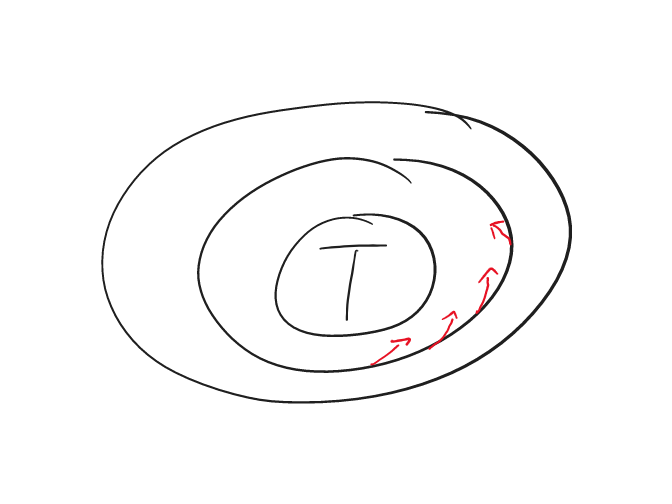

15. Die **Stärke des Windes** hängt ab von:
- Luftdruckgefälle => Abstand der Isobaren
- Größe der ablenkenden Kräfte der Erdrotation => Breite
- Reibung an der Erdoberfläche
- Krümmung der Windbahn

>Scheinkräfte die die Windgeschwindigkeit beeinflussen:   
- Der Coriolis-Effekt dreht die Richtung des Windes rechtwinklig nach rechts, wenn man auf der Nordhalbkugel vom hohen zum tiefen Druck schaut (Nordhalbkugel). Bei gleichem Isobarenabstand ist durch den Coriolis-Effekt in niederen Breiten die Windgeschwindigkeit größer als in höheren Breiten.   
- Die Reibungskraft verringert die Geschwindigkeit des Windes (auf 66% von der des geostrophischen Windes; Zahlenangabe nicht erforderlich!) und lenkt die Richtung über See um 22° zu den Isobaren zum tiefen Druck hin.   
- Die Zentrifugalkraft verstärkt/verringert die Windgeschwindigkeit bei antizyklonal/zyklonal gekrümmten Isobaren gegenüber parallel verlaufenden Isobaren mit gleichem Isobarenabstand. Infolge der Zentrifugalkraft ist bei gleichem Isobarenabstand die Windgeschwindigkeit an Hochdruckgebieten  größer als an Tiefdruckgebieten.

16. In amerikanischen Wetterkarten wird der geostrophische Wind auf 65% verringert, um eine gute Näherung an den Bodenwind zu erhalten. 

17. Der geostrophische Wind wird in den Bordwetterkarten 9 (Nord- und Ostsee)und 11 (Mittelmeer) mit einem **geostrophisches Windlineal** für einen Isobarenabstand von 10hPa angewandt.

18. **Böhen** sind Winde aus höheren Luftschichten. Windgeschwindigkeiten liegen bis zu 2 Bft über Mittelwinde. In der aufkommenden Bö ist der Wind rechtdrehend, in der abflauenden Bö rückdrehend (Nordhalbkugel).

19. Warnungen 

**Starkwindwarnung**: Erwartung von 6 bis 7 Bft
**Sturmwarnung**: Erwarung ab 8 Bft

20. Der **scheinbare Wind** setzt sich zusammen aus **wahrem Wind** und **Fahrtwind**.

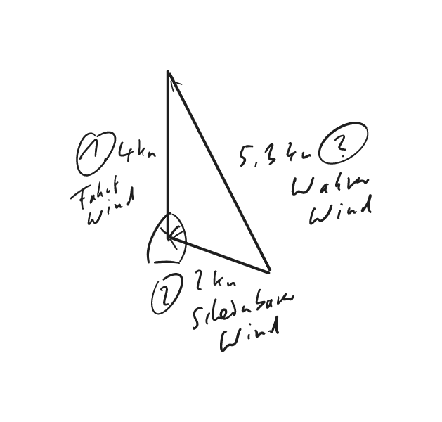

21. Die wahre Windstärke lässt sich durch Beobachtung seiner Einwirkung auf die See mit der Beaufort-Skala ermitteln. Die Richtung bekommt man durch Peilung der Windsee. 

| Beaufort | Auswirkung auf die See                                                                                                                                                                                                                                                                     |
|----------|--------------------------------------------------------------------------------------------------------------------------------------------------------------------------------------------------------------------------------------------------------------------------------------------|
| 0        | Spiegelglatte See.                                                                                                                                                                                                                                                                         |
| 1        | Kleine schuppenförmig aussehende Kräuselwellen ohne Schaumkämme.                                                                                                                                                                                                                           |
| 2        | Kleine Wellen, noch kurz, aber ausgeprägter. Die Kämme sehen glasig aus und brechen nicht.                                                                                                                                                                                                 |
| 3        | Die Kämme beginnen zu brechen. Der Schaum ist glasig. Vereinzelt können kleine weiße Schaumköpfe auftreten.                                                                                                                                                                                |
| 4        | Die Wellen sind zwar noch klein, werden aber länger. Weiße Schaumköpfe treten schon ziemlich verbreitet auf.                                                                                                                                                                               |
| 5        | Mäßige Wellen, die eine ausgeprägte lange Form annehmen. Weiße Schaumkämme bilden sich in großer Zahl. Vereinzelt kann schon etwas Gischt vorkommen.                                                                                                                                       |
| 6        | Die Bildung großer Wellen beginnt. Überall treten ausgedehnte weiße Schaumkämme auf, häufig mit Gischt.                                                                                                                                                                                    |
| 7        | Die See türmt sich. Der beim Brechen der Wellen entstehende weiße Schaum beginnt sich in Streifen in Windrichtung zu legen.                                                                                                                                                                |
| 8        | Mäßig hohe Wellenberge von beträchtlicher Länge. Die Kanten der Kämme beginnen zu Gischt zu verwehen. Gut ausgeprägte Schaumstreifen.                                                                                                                                                      |
| 9        | Hohe Wellenberge, dichte Schaumstreifen. Das bekannte "Rollen" der See beginnt. Die Gischt kann die Sicht beeinträchtigen.                                                                                                                                                                 |
| 10       | Sehr hohe Wellenberge mit langen überbrechenden Kämmen. Die entstehenden Schaumflächen werden in so dichten weißen Streifen in Richtung des Windes geweht, dass die Meeresoberfläche im Ganzen weiß aussieht. Das Rollen der See wird schwer und stoßartig. Die Sicht ist beeinträchtigt.  |
| 11       | Außergewöhnlich hohe Wellenberge. Kleine und mittelgroße Schiffe zeitweise hinter Wellenbergen verdeckt. Die See ist völlig von langen weißen Schaumflächen bedeckt. Überall werden die Kanten der Wellenkämme zu Gischt verweht. Die Sicht ist stark herabgesetzt.                        |
| 12       | Die Luft ist mit Schaum und Gischt angefüllt. Die See ist vollständig weiß von treibender Gischt.                                                                                                                                                                                          |
22. Planetarische Zirkulation in Bodennähe mit Wind- und Druckgürteln

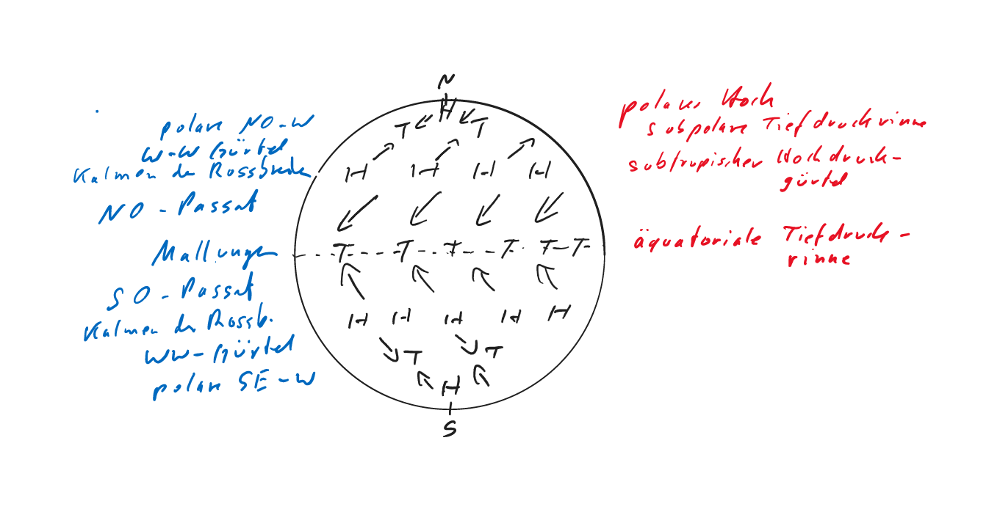

23. Näherung an die tatsächlichen Wind- und Druckverhältnisse: 

- Über planetarische Zirkulation (1)
- Zerfall der Druckgürtel in einzelne umfangreiche [Druckzellen](https://www.harald-blazy.de/bilder/vollbild.html?oeffentlich/planetarisches-windsystem.png) (2)
- Jahreszeitliche Mittelwerte (3)
- Monatsmittel von meteorologischen Größen wie Luftdruck, Wind, Temperatur, Feuchte, usw. (4)

24. [Hauptluftmassen, Prägung und Wege nach Mitteleuropa](http://www.klima-der-erde.de/hlm_groswetterlagen.html#:~:text=Auf%20der%20Erde%20gibt%20es,Polarluft%20P%20%2D%20kalt)

P = polare Luft  
T = tropische Luft  
c = continental => trocken  
m = maritime => feucht  
t = erwärmt gealtert  
p = abgekühlt gealtert         

Von Norden nach Südwesten auf Mitteleuropa zu: 

- mP, maritime Polarluft, kalt und feucht
- mPt, erwärmte maritime Polarluft, mäßig warm und feucht
- mTp, abgekühlte Tropikluft, mäßig warm und feucht
- mT, maritime Tropikluft, warm und feucht

Von Norden nach Südosten auf Mitteleuropa zu: 

- cP, kontinentale Polarluft, kalt und trocken
- cPt, erwärmte kontinentale Polarluft, Im Winter kalt und im Sommer warum und trocken
- cT, kontinentale Tropikluft, heiß und trocken

24. Durch die geographische Anordnung der Tief-und Hochdruckgebiete ensteht ein bestimmter **Luftmassentransport**. Verfolgt man den Weg der Luftmassen gedanklich zurück, lässt sich ableiten, welche Eigenschaften sie auf der Reise von ihrem Ursprungsgebiet her angenommen haben. 

# Wolken und Nebel

>1. Definitionen

- **absolute Feuchte a** = Anteil des unsichtbaren Wasserdampfes an allen Molekülen in der Luft. 
- **Sättigungsfeuchte A** = maximal mögliche Wasserdampfmenge bei einer bestimmten Temperatur. 

$$relative\ Feuchte\ U= \frac{a}{A}*100$$ 

- **Taupunkttemperatur** = Temperatur, bei der eine in der Luft vorhandene Wasserdampfmenge die Sättigungsmenge erreicht. 

>2. Luft kann zur Sättigung gebracht werden durch

- in dem Feuchte zugeführt wird (Feuchtezufuhr) => Verdunstungsnebel im Herbst 
- in dem die Temperatur gesenkt wird (Abkühlung) => Abkühlungsnebel im Frühjahr

3. Folgende Prozesse führen zu Regen: 

- Sättigung
- Kondensation
- Tröpfchenbildung
- Auftriebsüberwindung

Bei der Wolken- und Nebelbildung verdichten sich durch  **Kondensation** kleine Tröpfchen, die mit der allgemeinen Unruhe in der Luft schweben. 

4. Vorgänge die Luft in größere Höhen bringt: 

- **Cumulus**: Luft steigt auf weil sie wärmer ist als die Umgebung (Konvektion)
- **Stratus**: Feuchtwarme Luft gleitet an einer kalten Luftschicht auf und es entstehen Schichtwolken (Angleitwolken)
- **Culmulus und Stratus**: Luft wird durch Berge (orthographische Hindernisse) zum Aufsteigen gezwungen, es zeigt sich Staubewölkung
- **Stratus oder Stratocumulus**: Wind und die allgemeine Rauhigleit der Landschaft lassen Luft bis zum Kondensationsniveau aufwirbeln (Turbulenzwolken). Es können dabei Schicht oder Schichthaufenwolken enstehen
- **Wogenwolken**: Die Luft steigt wellenförmig in das Kondensationsniveau hinein und wieder heraus. Häufig in Lee von Gebirgen.

>Es gibt Haufenwolken (Cumulus) und Schichtwolken (Stratus). Cirrus, Cirrostratus, Cirrocumulus, Altostratus, Altocumulus, Nimbostratus, Stratocumulus, Stratus, Cumulus, Cumulonimbus.

5. Wolkenfamilien International, nach Aufbau und Höhe:

- hohe Wolken 
- mittelhohe Wolken 
- tiefe Wolken  
- Wolken mit vertikaler Entwicklung

>Tiefe Wolken zwischen 0 und 2 km, mittelhohe Wolken zwischen 2 und 7 km und hohe Wolken zwischen 7 und 13 km.

>Altocumulus castellanus kündigen oft schon vormittags kräftige Wärmegewitter an.

>Haufenwolke (Cumulus) zeigen sich am späten Vormittag über Land am Himmel und kündigt Seewind an?

 
6. Die zehn amtlichen Wolkengattungen

|||
|-|-|
|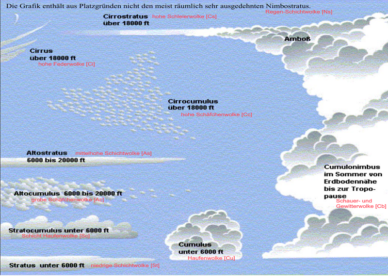|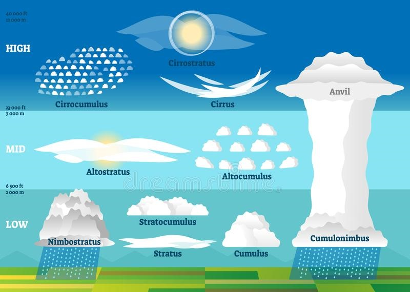|

7. Verschlüsselung der Wolken: 

- C~L~ - tiefe Wolken (Stratocumulus, Stratus, Cumulus, Cumulonimbus)  
- C~M~ - mittelhohe Wolken (Altocumulus, Altostratus, Nimbostratus)  
- C~H~ - hohe Wolken (Cirrus, Cirrocumulus, Cirrostratus)  

8. Gewitter

| Art | Unterscheidung | Entstehung |
|-----|-----------|-------------------|
|**Luftmassengewitter**|bilden sich durch aufsteigende Luft|- Erwärmung von unten (z. B. Sonneneinstrahlung), Wärmegewitter durch Thermik  - Hebung an Gebirgen (orthograpische Hebung, oder orthographische Gewitter)   - Stau von strömender Luft am Boden und Ausweichen in die Höhe (Konvergenz, Konvergenzlinie)|
|**Frontgewitter**|enstehen an Fronten (Übergangszone/Grenzschicht) von Luftmassengrenzen|Durch sich darunter schiebende Kaltluft erfolgt eine Hebung und Labilisierung der Warmluft |

>Gewitter treten bei Cumulonimbuswolken auf; diese Wolkenart ist beim bzw. nach dem Durchgang einer (ausgeprägten) Kaltfront sowie über Inseln und stark aufgeheizten Landflächen zu erwarten. (Die Atmosphäre muss hochreichend labil oder feuchtlabil geschichtet sein).

>Gewitterarten über See: Luftmassengewitter (Wärmegewitter) und Frontgewitter (an Kaltfront)

> Gefahren für Segelfahrzeug bei Gewitter:  
- Böen bis Orkanstärke aus häufig wechselnden Richtungen   
- Starke Regenfälle mit erheblicher Sichtminderung   
- Hagelschlag, Blitzschlag  
- Hoher Seegang, Kreuzseen 

>Markante Zeichen für das Herannahen eines Gewitters sind:  
- mächtige, turmartige Haufenwolken (Cumulonimben),  
- sehr dunkle Wolkenunterseite mit vorgelagerter Böenwalze  
- der bisher vorhandene Wind flaut ab, frischt danach aus anderen Richtungen auf,  
- einsetzende Abkühlung der Luft, 
- Auffallende Störgeräusche im Mittelwellenbereich des Rundfunkgerätes 

9. Böhen

- **Böhenkragen**: Walzenförmige Wolke mit horizontal verlaufender Achse an der vordderseite des Gewitters
- **Böhenlinie**: Äußerste Grenze des Kaltluftschwalls bei Gewitter

10. Warmfront

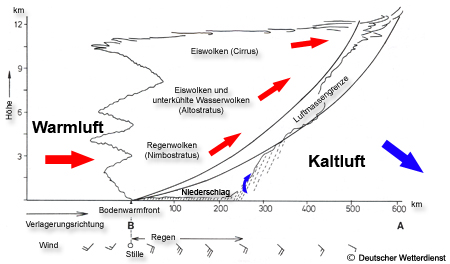

>Wolkenarten und -höhen:  
- Cirren Höhe 7.000 bis ca. 12.000m  
- Cirrostratus ab ca. 5.000m  
- Altostratus 2.500 bis 5.000m  
- Nimbostratus wenige 100m bis 5.000m  

>Wolken als erste Anzeichen für das Herannahen einer Warmfront: Cirren; sie bestehen aus kleinen Eiskristallen.

>Die Cirren als ersten Anzeichen einer ausgeprägten Warmfront erscheinen ca. 500-600 km vor der Bodenfront.

>Windstärken und –richtungen vom ersten Anzeichen einer aufziehenden Warmfront bis zu deren Durchzug: 
Windstille oder schwach umlaufende Winde, u.U. auch rückdrehender Wind, schwache Winde aus SE-lichen Richtungen rechtdrehend unter langsamer Zunahme bis SW-liche Richtungen

>Aus Altostratus kann bereits leichter Regen fallen. In einem 100 bis 300 km breiten Streifen vor der Front fällt aus Nimbostratus leichter bis starker Dauerregen (Landregen), bei entsprechender Temperatur auch Schnee. Direkt an oder hinter der Front geht der Niederschlag häufig in Sprühregen über.

>(Die Warmfront mit warmer, feuchter Luft gleitet auf die vor ihr liegende Kaltfront auf, wobei sich ein ausgedehntes Wolkenfeld entwickelt). Zuerst sind Cirren in großer Höhe zu erkennen (etwa 8-9 km hoch), die in Schichtwolken, wie Cirrostratus und Altosratus übergehen. Im weiteren Verlauf der Warmfrontverlagerung bilden sich Nimbusstratuswolken, also Schichtwolken in mittlerer Höhe, aber mit einer erheblichen horizontalen Ausdehnung. Bis zum Durchgang der Warmfront befindet sich über dem Beobachter eine dichte Wolkendecke, die geschlossen in Höhen von 6-8 km reicht.

>Von den ersten Anzeichen bis zum Durchzug der Warmfront beobachtet man schwache Winde aus SE, langsam rechtdrehend aus Süd, Stärke Bft.3, weiter rechtdrehend auf SW und zunehmend bis Stärke Bft. 5. Das ausgedehnte Nimbus- Wolkenfeld bringt Schlechtwetter mit anhaltenden kräftigen Niederschlägen, die
bei Durchzug der Bodenfront in Sprühregen übergehen.

11. Kaltfront

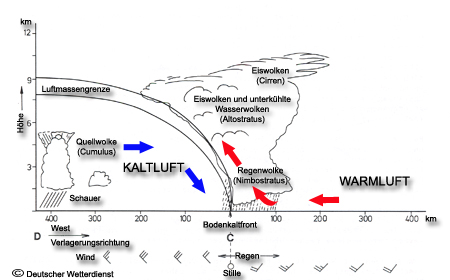

- Kaltfront Typ A (aktive Kaltfreont): Kaltluft stößt heftig gegen Warmluft. Es enstehen Altocumulus  
- Kaltfront Typ B (passive Kaltfront): Kaltluft schiebt sich langsam unter die Warmluft und hebt sie hoch. Warmluft wird von unten abgekühlt. Es entstehen Schichtwolken.

12. **Okklusionsfront**: Kaltfronten, die mit Tiefdruckgebieten verbunden sind ziehen schneller als die Warmfronten der Tiefs. Dadurch holt die eine Front die andere ein und schiebt Luft, die dazwischen lag, in die Höhe.

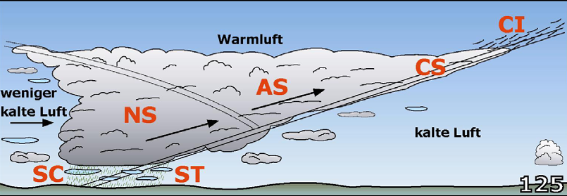  

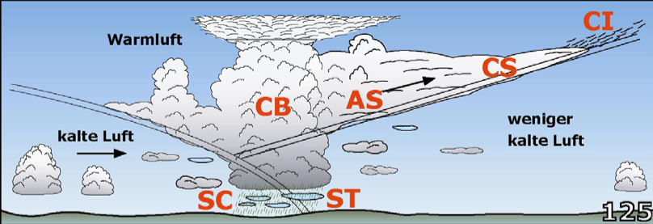  

>Okklusion ist die Front in einem Tiefdruckgebiet, bei der die Kaltfront die Warmfront eingeholt hat.

>Durch die höhere Verlagerungsgeschwindigkeit holt die Kaltfront die Warmfront ein und hebt die Warmluft vom Boden ab. Ist die Luft vor der Front kälter als hinter der Front, so nimmt diese Warmluftcharakter an (Warmfrontokklusion), im anderen Fall Kaltfrontcharakter (Kaltfrontokklusion).

13. Nebelbildung

|Art|Prozess|Beispiel|
|---|-------|--------|
|Abkühlungsnebel (Warmluftadvektion)|Feuchte Warmluft führt über kalte Wasseroberfläche  Abkühlung =>Sättigung => Konvektion|Seenebel, Frühjahrsnebel, Kaltwassernebel|
|Verdustungsnebel (Kaltluftadvektion)|Heranziehende Kaltluft führt über warme Wasseroberfläche   Feuchtezufuhr => Kondensation|Warmwassernebel, Herbstnebel, Seerauch|
|Mischungsnebel|Zwei Luftmassen mit untschiedlicher Temperatur und Feuchte vermischen sich.  Die eine Luft kühlt die andere ab oder reichert sie mit Wassersampf an.|Küstennebel, Frontnebel|
|Strahlungsnebel|Erde strahlt  Wärme ins All ab (klare Nächte, Morgenstunden) verdrifteter Nebel|Hochnebel|
|Orthographischer Nebel|Luft mit hoher Feuchte wird an Gebirgen oder Inseln zum Aufsteigen gezwungen. Geringerer Druck in der Höhe => Ausdehnung => Abkühlung => Sättigung => Nebel|Inselnebel|

>Entstehung von Strahlungsnebel: Nach Sonnenuntergang kann sich bei klarem Himmel die bodennahe Luftschicht über Land bis unter die Taupunktstemperatur abkühlen; es entsteht Srahlungsnebel. Durch den Wind verdriftet der Strahlungsnebel in Küstennähe auf die See, er ist aber auch besonders auf Flüssen und in engen Durchfahrten (zwischen Inseln) vorhanden.

# Druckgebilde

1. Hochdruckgebiete

Hoher Barometerstand => Luft ist schwerer

Zwei Möglichkeiten:  

- Luft mit größerer Dichte: Wenn Luft kälter ist als die der Umgebung => **thermisch bedingt Hochs** 

- Mehr Luft als in der Umgebung => **Luftstau in der Höhe**

2. Wetter in Hochdruckgebieten

**absteigende Luft** => **Wolken lösen sich auf** 

>Im Hoch steigt die Luft ab, kommt dabei unter höheren Druck, erwärmt sich, trocknet aus und die Wolken lösen sich auf.

|Jahreszeit|Wetter bei Hochdruck|
|----------|--------------------|
|Sommer|Sonniges Wetter mit blauem Himmel. Am Tag vereinzelt Cumuli, bei großer Feuchte oft dunstig.|
|Winter|- klirrender Frost bei strahlend blauem Himmel, aus trockener Kaltluft aufgebauten Hochs - Vom Meer her kommende feuchte Luft => bodennahe zu Nebel neigende feuchte, diesige Schicht, Oberhalb wolkenlos und klar = Inversion => Hochnebel mit manchmal Sprühnebel oder Schnee|
|Übergangszeit|Sonnneneinstrahlung löst winterlicher nächtlicher Charakter auf => sommerliches Hochdruckwetter|

>Oft nicht so schön, wie allgemein erwartet (z.B. im April/Mai in der Nordsee) weil Hochdruckgebiete haben eine warme Seite mit südlichen Winden und eine kalte Seite mit nördlichen Winden. Auf der kalten Seite wird über dem Wasser kalte, wolkenreiche Luft transportiert. In Hochdruckgebieten steigt erwärmte Luft ab, die die bodennahe Luft nicht wegräumen kann. Es bildet sich eine Übergangsschicht – eine Inversion. An dieser entstehen durchgehende Schichtwolken (Stratus).

3. Hochdruckgebiete

|||
|-|-|
|Hochdruckbrücke 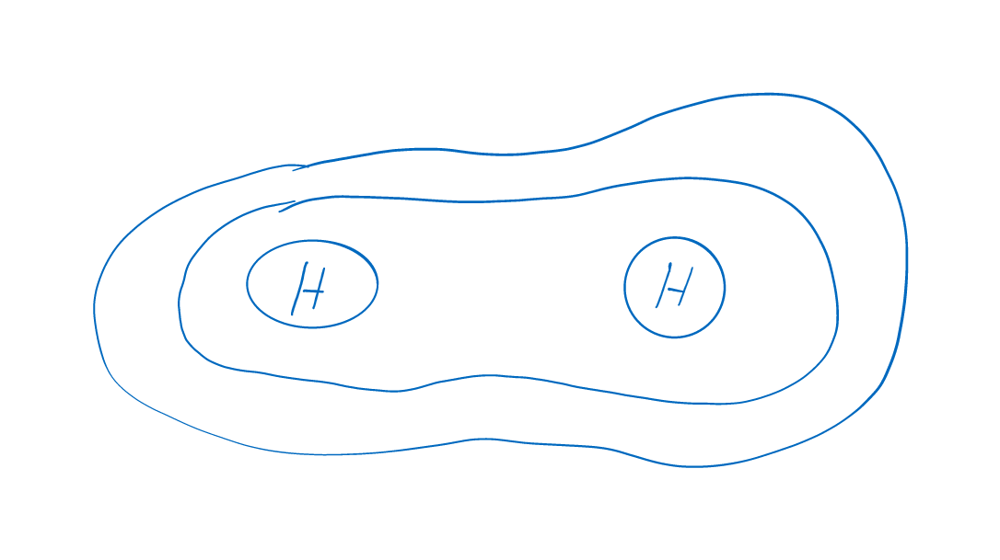 |Zwischenhoch 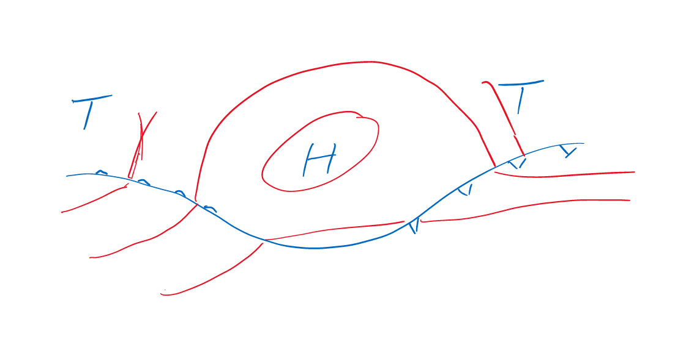|

4. Wetter in Nord-Deutschland zwischen zwei Hochdruckgebieten

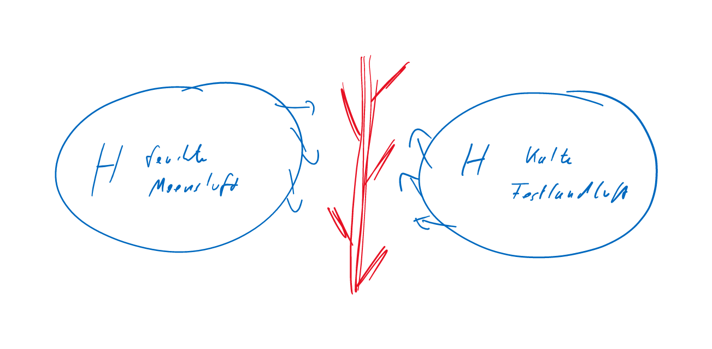

5. Druckverteilung an Sattelpunkt
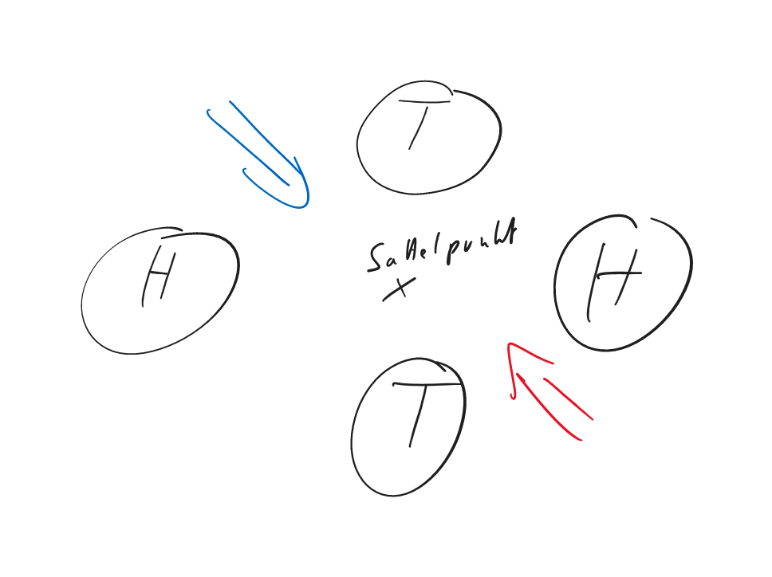

6. Lebenslauf einer Zyklone/Entwicklungsstufen eines Tiefs

- stationäre Front
- Wellenstörung  
- junges Ideales Tief   
- okkludierendes Tief 
- Auflösung oder Weiterentwicklung zu einer Zentralzyklone (rießiges Tief)  

7. Lebenslauf einer Zyklone
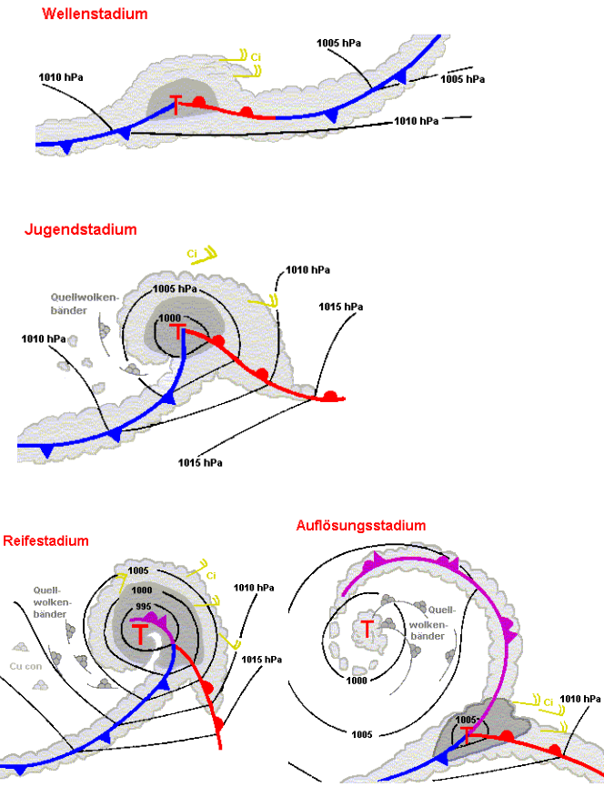

8. **Luftströmungen** in einem Hoch und in einem Tief

>Im Zentrum des Hochs herrscht Flaute. In Hochdruckgebieten steigt die Luft ab. Aus dem Hoch (Antizyklone) weht der Wind auf der Nordhalbkugel im Uhrzeigersinn (antizyklonal) heraus (22 Grad von den Isobaren vom Hoch weg).  
Die Luft strömt entgegen dem Uhrzeigersinn (zyklonal) in ein Tief (Zyklone) hinein, wo sie aufsteigt und in höhere Schichten abfließt (22 Grad von den Isobaren zum Tief hin).

9. **Regel von Buys-Ballot**

Stellt man sich mit dem Rücken zum Wind, dann befindet sich das Tief auf der linken Seite, zwei Strich vorlicher als querab. Das Hoch liegt auf der rechten Seite, zwei Strich achterlicher als querab. Dies gilt für die Nordhalbkugel.

>Sie segeln in der Ostsee vor dem Wind:   
- Ein vor dem Winde segelndes Schiff hat auf der Nordhalbkugel den tieferen Druck stets etwas vorlicher
(ca.20° ) als querab an Backbord. SP= 280° - 300°.    
- Der hohe Druck befindet sich etwas achterlicher (ca. 20° ) als querab an Stb. SP=
100° - 120°.

10. **Rechtdrehend** bedeutet Änderung der Windrichtung im Uhrzeigersinn. **Rückdrehend** bedeutet Änderung der Windrichtung gegen den Uhrzeigersinn um mindestens 45°.

11. An Hoch- und Tiefdruckgebieten befinden sich **gekrümmte Isobaren** Ein Luftteilchen, das solch eine Krümmung durchläuft, unterliegt der Fliehkraft, die die Winstärke ändert: An Tiefdruckgebieten ist bei gleichem Isobarenabstan die Windgeschwindigkeit geringer als bei parallelen Isobaren, an Hochdruckgebieten ist sie größer. 

12. **Wetterverlauf** einer vorüberziehenden Zyklone

- Aufzug (Cirren, Cs, dünner, dann dichter Altostratus)  
- Niederschlagsgebiet (Nimbostratus, Landregen)
- Aufheiterung vor der Front (selten)
- Warmfront
- Warmsektor
- Böhenlinie (Bei Frontgewitter)
- Kaltfront
- Aufheiterung hinter der Front (öfter)
- Rückseitenwetter (Cu, Cb, Aprilwetter)

13. Wettererscheinungen an Warmfront

- Vor der Front: 
  - Wolkenaufzug in bestimmten Höhen  
  - Ci (500 bis100 km vor Bodenberührung), Cs, As, Ni  
  - schwacher Wind, nimmt zur Front hin zu, rechtsdrehend und häufig aus SW.  
  - Aus Ns fällt Regen (Landregen)    
  - Lufttemperatur ändert sich kaum  
  - Luftdruck fällt  
  - Sicht wird schlechter 
 
- Beim Durchgang der Front
  - Anstieg der Temperatur
  - Ende des stetigen Druckabfalls
  - Windsprung mit rechtsdrehendem Wind
  - stärkste Niederschläge
  - schlechte Sicht

14. Wettererscheinungen an Kaltfront

- Kurz vor der Kaltfront
 - Luftdruck fällt wieder
 - Windgeschwindigkeit nimmt zu
 - Wolkenwand aus tief hängenden Ns (Cb möglich)
 - beginnender Niederschlag
 
- Beim passieren der Front
  - Luftdruck steigt sprunghaft
  - Windsprung rechtsdrehend
  - Zunahme der Windgeschwindigkeit, Böhen
  - schauerartige Niederschläge, schlecht Sicht
  - Temperatur sinkt
  - Sicht verbessert sich
  - Rückseitenwetter

14. Spezielle Tiefdruckgebiete
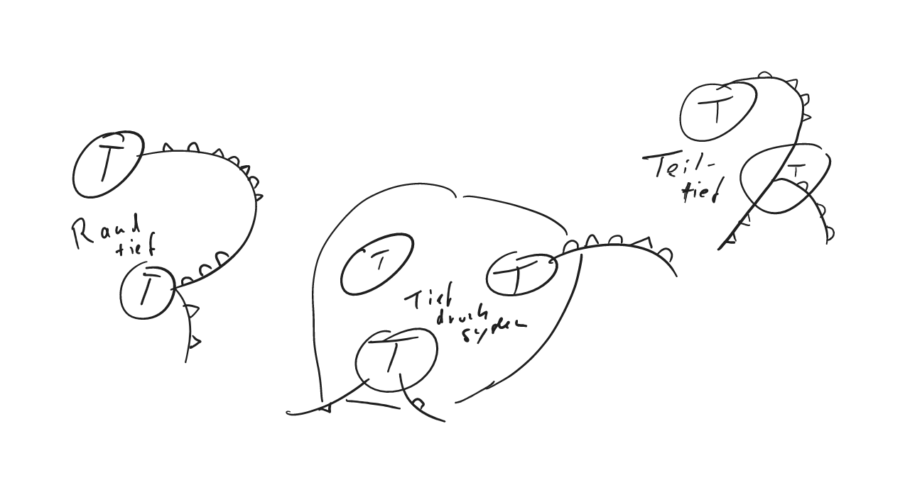

16. **Trog** oder **Tiefdruckdrog** meint, dass die Isobaren eine Ausbeulung haben. 
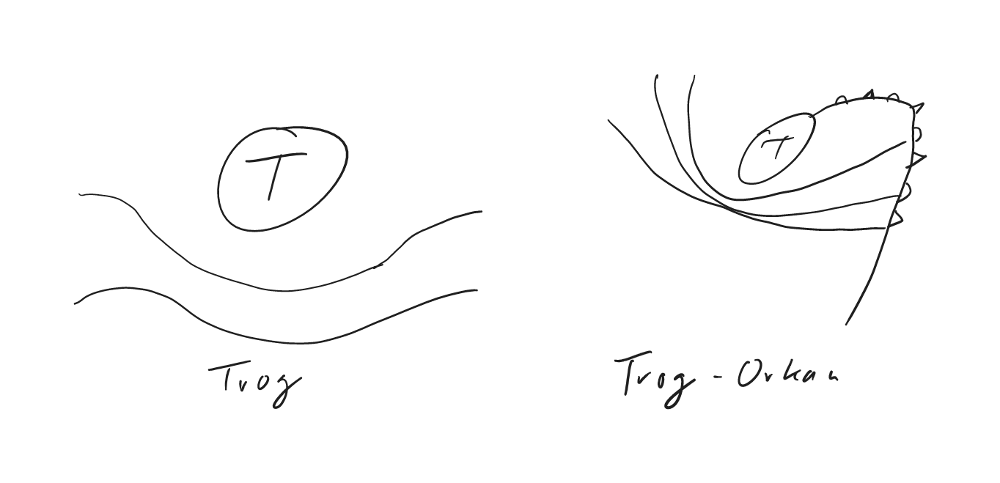

>Bei einem trogförmig angeordneten Isobarenverlauf, der Ähnlichkeiten hat mit der unteren Hälfte eines Schüssel, spricht man von einem Trog. Außer der Winddrehung und den Niederschlägen im Bereich der Trogachse sind normale Tröge ungefährlich. Allerdings besteht Gewittergefahr. Liegen den Isobaren im Trog jedoch sehr eng beieinander, können in Trögen die gefährlichsten Stürme der gemäßigten Breiten auftreten. Durch die unterschiedliche Windrichtung hinter und vor der Trogachse entsteht Kreuzsee aus Dünung und Windsee.

> So lässt sich ein herannahmender Trog in einem Tief erkennen: Nach Durchgang der Kaltfront dreht der Wind nicht auf NW bis NNW, ist also nicht rechtdrehend, sondern behält seine Richtung bei und ist sogar rückdrehend. Der Druck steigt nach Durchgang der Kaltfront nicht an, ist gleichbleibend und beginnt schließlich zu fallen. Die Bewölkung nimmt zu, und Niederschläge folgen.

17. Zyklonenfamilie
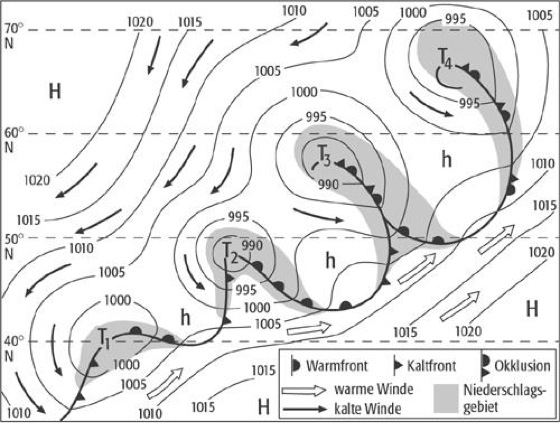

 18. Abweichend von der Idealzyklonen können Tiefdruckgebiete **mehr als eine Kalt-,  Warm- oder Okklusionsfront** hintereinander haben. 
 
 19. Tiefs
 
 - dynamische: In Tiefdruckgebieten mit Fronten werden unterschiedliche Luftmassen zusammengeführt. 
 - thermische: Durch große Luftbewegungen entstehen vertikale Luftbewegungen. Sie haben keine Fronten. Im Extremfall entwickeln sie sich zu Wirbelstürmen wie in den Tropen.
 
# Regionale Wettererscheinungen
 
 1. Winde in Küstennähe
 
 - Seewind: Sonne => Land wird stärker erwärmt als See => Luftmassen über Land steigen auf => Druck in Bodennähe fällt => Druck auf See ist nun höher => Wind von See zum Land  
 
 > Seewind: Mittags/nachmittags kommt von der See her eine leichte bis mäßige Brise. Maximum des Seewindes ca. 2 Stunden nach Sonnenhöchststand, er flaut gegen Abend wieder ab. Über Land bildet sich infolge der starken Sonneneinstrahlung und der dadurch bewirkten Aufheizung der Luft ein thermisches Tiefdruckgebiet, in das von See her Wind einströmt.

 - Landwind (Zirkulation dreht sich): Abkühlung des Landes nachts => See ist warm => Luft strömt von Land über das Wasser.
 
 >Landwind: Gegen Mitternacht beginnt eine schwache Landbrise, die maximale Windstärke ist in der Regel zwischen ca. 03.00 Uhr und Sonnenaufgang. Nachts kühlt das Festland stärker ab als das Wasser, über dem Land bildet sich ein thermisches Hochdruckgebiet aus dem Luft zum Meer hin strömt.
 
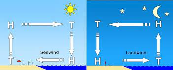
>Wo: Bei intensiver Sonnenstrahlung in unmittelbarer Küstennähe. Verstärktes Auftreten bei trockener Küste, da sich dann das Land schneller erwärmt bzw. abkühlt.

2. Effekte an gebirgigen Küsten: 

- Steilküsteneffekt  
- Kapeffekt  
- Inseleffekt  
- Düseneffekt  
- Leewirbel  
- Fallwinde  

> Windverhältnisse in der Nähe von Steilkästen:   
- Auflandiger Wind: Der Wind wird aus Küstenführung zum Teil beschleunigt wenn er nahezu auflandig oder parallel zur Küste weht.     
- Ablandiger Wind: Weht der Wind ablandig, muss örtlich mit umlaufenden Winden und erhöhter Böigkeit (Fallwinden) gerechnet  
werden.

3. Orographische Effekte
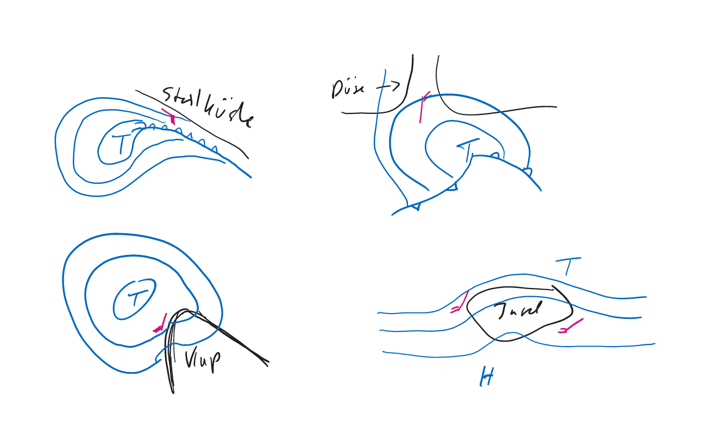

4. Verschiedene Mistral-Wetterlagen

- Küstennaher Mistral: Thermische Zirkulation, eine Art Landwind  
- Mistral mit thermischem Tief oder Leetief ohne Fronten im Ligurischen Meer oder Golf du Lion.  
- Mistral verstärkt durch ein Tieff mit Fronten, dessen Rückseite Luft aus Südfrankreich ansaugt.  
- Mistral im Übergangsbereich zwischen einem ausgedehnten Tief über Nord- und Osteuropa und hohem Druck über West- und Südwesteuropa.

>Mistralgegenden:  
- Mittelmeerküste Frankreich (Golf de Lion) bis zum Golf von Genua.    
- Ebrotal bei Tarragona (Spanien),   
- Düsenwirkung bei Perpignan durch Pyrenäen und Zentralmasiv,   
- Düsenwirkung bei der Rhonemündung durch Zentralmasiv und Alpen bis,  
- Bereich Marseille-Toulon Hafen bis Bastia (Korsika).  

>Wettermäßig (Anzeichen!) bei einer „mistralverdächtigen“ Wetterlage zu achten auf:  
- Verlagerung einer Kaltfront über Frankreich nach Süden oder Südosten,   
- merkbarer Temperaturrückgang hinter der Kaltfront,   
- Bildung eines Leetiefs im Golf von Genua  
- Azorenhoch mit Ausbildung eines Keils über Biskaya/Spanien  

>Häufigkeiten eines Mistrals mit Sturmstärke und Dauer einer Mistralperiode:
Volle Sturmstärke wird nur an wenigen Tagen im Jahr erreicht, Marseille z.B. an 10 bis 15 Tagen. Die Häufigkeit nimmt über See zu. Die häufigste Dauer beträgt 3,5 (3-4) Tage.

>Amtlichen Publikation über den Mistral und seine Folgen (Seegang, Wellenhöhe usw.):
Seehandbuch: Mittelmeer-Handbuch 

5. **Boraartige und föhnartike Fallwinde** sind die an der kroatischen und albanischen Küste auftretenden kalten Fallwinde.

Kalte Luft im Hochland => Thermischer Gegensatz zu Adria => Bewegung  

Gebirgseinschnitte, Flusstäler und Fjorde => Verstärkung der Fallwinde

6. Arten von Bora

- **antizyklische Bora**: Bora ensteht an der südlichen Flanke eines umfangreichen Hochs oder Hochkeils. 
- **zyklonale Bora**: Gebiet der Adria liegt im Einflussbereich der nördlichen Seite eines Tiefs

Windgeschwindigkeiten: 48 bis 55kn (schwerer Sturm)  
Richtung: ENE   
Dauer: Bis zu einem Tag  

>Die Bora ist in der Adria ein gefürchteter Wind, der aus NNE bis NE aus den nördlichen Hochlagen des Balkans als Fallwind mit Sturmstärken in die Adria einfällt. Ursache: Hoher Druck über Mitteleuropa und tiefer Druck im Mittelmeer (im Süden der Adria oder südlich davon )führen (je nach Einfluss der Druckgebilde und deren Lagen zueinander) zur zyklonalen oder antizyklonalen Bora. Im Winter gefährlicher wegen der großen Temperaturunterschiede: Kaltes Hinterland – warmes Meer. Führt zu länger anhaltendem Sturm. Im Sommer sind auch große Windstärken möglich, jedoch nicht so anhaltend wie im Winter.

>Wettererscheinungen:  
- Antizyklonale Bora: Es überwiegt der Einfluss des Hochdruckgebietes über dem mittel- oder osteuropäischen Festland. Wolkenbildung an den Gebirgskämmen, Wolkenauflösung über See; klare, trockene Luft. Cumuluswolken.  
- Zyklonale Bora: Es überwiegt der Einfluss der Mittelmeerzyklone, die mit ihren Fronten bei zeitweiser Schichtbewölkung heftige Sturmböen, ergiebige Niederschläge (Regen, Hagel, zeitlich auch Schnee) mit
sich bringt. Sie gilt als gefährlicher.

7. **Schirokko** 

=> alle Südwinde von der Südküste des Mittelmeeres

Voraussetzung: Tief im Bereich der Südküste, das die trockende, heiße Luft auf das Meer hinausbefördert. 

Wandert der Schirokko nach Norden => Feuchtigkeitsaufnahme => Schwüle

8. **Etesien**

=> Jährlich auftretender Wind aus dem nördlichen Sektor der Ägäis.  

**Meltemi**: Etesien in türkischen Gewässsern. 

Dieser Wind ist an eine großräumige Druckverteilung gebunden: hoher Druck über Südeuropa, der bis zur Ägäis reicht, und tiefer Druck über Kleinasien und dem östlichen Mittelmeer. 

Windstärke im Juli und August: 5 bis 7 Bft

>Die Etesien (griechisch; türkisch: Meltemi) sind jährlich wiederkehrende, nördliche Winde in der Ägäis. Die Etesien entstehen zwischen einem Hoch über Südeuropa und in einem Tief in Kleinasien. Diese großräumige Druckverteilung ist sehr beständig. Insofern wehen die Etesien von Mai bis Oktober mit einer Beständigkeit von 80%. Die durchschnittliche Windgeschwindigkeit beträgt im Juli/ August 5 Bft in einem Streifen in der Mitte des Ägäischen Meeres. Der Seegang kann unangenehm sein. Da kontinentale Luft von den Etesien transportiert wird, herrscht wolkenloses Wetter mit guter Sicht.

# Wetterregeln

1. Sinn der Wetterregeln neben der normalen Versorgung mit Wetterberichten: 

- Verständniss des Wettergeschehens
- Kontrolle des Wetterablaufs zwischen zwei Sendeterminen
- Erkennen unerwarteter Entwicklungen und ihrer weiteren Beurteilung

2. **Wetterregeln**

- Eine junge Zyklone mit offenem Warmsektor verlagert sich in Richtung der Isobaren dieses Sektors.

- mittlere Zuggeschwindigkeit von Zyklonen:
  - junge: 20 - 30 kn
  - okkudierende: 10 - 15 kn
  => im Sommer m ehr die untere Grenze im Winter mehr die obere Grenze
  
- Eine sich auffüllende Zyklone schreitet langsamer fort als eine sich vertiefende.

- Ausgeprägte Tiefs mit vielen Isobaren schreiten meist nurlangsam fort.

- Ein Randtief umkreist das Haupttief auf der Nordhalbkugel entgegen dem Uhrzeigersinn.

- Am Okklusionspunkt enstehende Teiltiefs schwenken nicht um das Haupttief, sondern bewegen sich nach der [Warmsektorregel](https://www.wetter.net/wetterlexikon/eintrag/warmsektor#:~:text=Da%20die%20Kaltfront%20in%20der,in%20die%20H%C3%B6he%20verdr%C3%A4ngt%20wurde.).

- Ein Tief das sich mit seiner Vorderseite einem Hoch nähert, verstärkt dort seine Winde. 

- Ein Tiefausläufer schreitet mit Vorliebe in 24 h zu der Stätte des ihm vorangegangenen Hochkeils und umgekehrt. 

- kleinere Zyklonen umkreisen umfangreiche Antozyklonen auf der Nordhalbkugel im Uhrzeigersinn.

- Hat ein Tiefdrucksystem zwei nahezu gleich große Kerne (Tiefs), beginnen diese um ihren gemeinsamen Schwerpunkt zu kreisen. 

- Kleine Hochs wandern schnell, umfangreiche nur langsam. 

- Die Hochdruckkeile zwischen den Zyklonen der Westwindzone verlagern sich mit der Zuggeschwindigkeit der sie umgebenden Zyklonen. 

- Wandernde Hochdruckgebiete haben in ihrer Zugbahn auf der Nordhalbkugel eine Tendenz nach rechts (zum Äquator hin). Im Gegensatz dazu tendieren Zyklonen nach links (polwärts).

> Ein okkludiertes Tief schwenkt auf der Nordhalbkugel nach links von seiner bisherigen Bahn (Poltendenz). Die Bahngeschwindigkeit verringert sich.

- Fronten bewegen sich umso rascher, je mehr Isobaren sie schneiden.

- Fronten bei denen die Isobaren in einem spitzen Winkel auf die Fronten treffen, bewegen sich nur langsam. 

- Isobarenparallele Fronten sind im Allgemeinen stationär.

- Kaltfronten ziehen - manchmal doppelt - schneller als Warmfronten

- Fronten verlagern sich in Richtung des Windes hinter ihnen. 

## Regeln über die Bewegung von Zyklonen und Antizyklonen 

1. Eine junge Zyklone (T) mit offenem Warmsektor (keine Okklusion) verlagert sich in Richtung der Isobaren dieses Warmsektors.  

2. Mittlere Zuggeschwindigkeit: 
langsam: < 15kn  
ziehend: 15kn – 25kn  
rasch ziehend: 25kn – 45kn   
schnell/sehr rasch: > 45kn  
- junge Zyklonen 25-30kn (entspricht 10-12 Breitengrade pro Tag)   
- okkludierte Zyklonen 10-15kn (entspricht 4-6 Breitengrade pro Tag)  
- im Sommer im Allgemeinen 5-10kn weniger

3. Eine sich auffüllende Zyklone zieht langsamer als eine sich vertiefende

4. Ausgeprägte Tiefs mit vielen Isobaren und starkem Luftdruckgradienten nach allen Seiten ziehen meist nur langsam

5. Ein Randtief umkreist das Haupttief auf der N-Halbkugel gegen den Uhrzeigersinn. Zugbahn polwärts gekrümmt. Das Zentrum des Randtiefs ist nach 24h etwa auf der tiefsten 5 hPa-Isobare die das Randtief mit dem Haupttief verbindet (Rodewald-Regel)

6. Am Okklusionspunkt entstehende Teiltiefs schwenken nicht gegen Uhrzeigersinn um das Haupttief sondern ziehen nach der Warmsektorregel (s. 1.) – oder Zugbahn schert leicht äquatorwärts aus

7. Eine Zyklone mit starkem Wind auf der Vorderseite wird stationär und schwächt sich ab 

8. Voll entwickelte Tiefs bewegen sich häufig in Richtung der stärksten Winde

9. Größere festliegende Tiefs können lange lebensfähig bleiben, wenn sie an der Grenze zwischen kalter und warmer Unterlage liegen (z.B. an der Küste oder der Eisgrenze)

10. Kleinere Zyklonen (T) umkreisen umfangreiche festliegende Antizyklonen (H) auf der N-Halbkugen
im Uhrzeigersinn

## Regeln über die Entwicklung von Luftdruckgebilden 

11. Zyklonen mit ausgeprägtem Warmsektor vertiefen sich und beschleunigen meist ihre Bewegung

12. Eine sich abschwächende Zyklone wird reaktiviert, wenn sich der Temperaturunterschied ihrer Luftmassen vergrößert (neue Kaltluft in der Rückseite oder neue Warmluft in der Vorderseite

13. Eine Zyklone vertieft sich, wenn die Labilität ihrer Luftmassen zunimmt (im Sommer beim Übertritt vom Meer aufs Land, im Winter beim Übertritt vom Land aufs Meer – beim Ubertritt auf einen wärmeren Untergrund) 

## Regeln über die Bewegung von Fronten 

14. Kaltfronten ziehen schneller als Warmfronten, manchmal doppelt so schnell

15. Fronten verlagern sich in Richtung des Windes hinter ihnen. Kaltfronten und Okklusionen fast mit der Geschwindigkeit des Bodenwindes hinter ihnen, Warmfronten etwas langsamer.

16. Fronten bewegen sich um so rascher je mehr Isobaren sie schneiden 

17. Fronten, bei denen die Isobaren im spitzen Winkel auf die Front treffen ziehen nur langsam 

18. Nähert sich eine Front einem stationären Hochdruckgebiet verlangsamt sich ihre Bewegung 

## Regeln über die Entwicklung von Fronten

19. Fronten lösen sich in antizyklonalen Gebieten (H) auf

## Regeln über die Eigenschaften von Luftmassen 

20. Bewegt sich eine Luftmasse über eine kältere Unterlage nimmt die Stabilität ihrer Schichtung zu 

21. Bewegt sich eine Luftmasse über eine wärmere Unterlage nimmt die Stabilität ihrer Schichtung ab 

22. Tiefblauer Himmel zeigt meist trockene Luft an, hellblauer ist ein Zeichen für feuchte Luft

## Luftdruckregeln 

>23. Gleichbleibender Luftdruck deutet auf beständiges Wetter (und Wind) hin 

>24. Langsamer und gleichmäßiger Luftdruckanstieg bedeutet meist nachhaltige Wetterbesserung 

>25. Bei schnellem Luftdruckanstieg ist die Wetterbesserung meist nur vorübergehend 

26. Eine Luftdruckänderung von mehr als 4 hPa in 3 h kann Wind von 6-8 Bft bringen 

27. Eine Luftdruckänderung von mehr als 10 hPa in 3 h kann schweren Sturm bringen

## Regeln über den Wind 

28. Ändert sich die schon längere Zeit beständige Windrichtung deutet das auf Wetteränderung hin 

29. Land- und Seewind sind Anzeichen für beständiges Wetter

## Wolkenregeln

30. Kräftige Morgenrot bedeutet viel Wasserdampf in der Luft, das kann Wetterverschlechteung bedeuten

31. Querwindregel: Dreht der Wind oberhalb der Reibungsschicht mit der Höhe recht, so führt er wärmere Luft heran (Vorderseite eines Tiefs). Dreht er mit der Höhe rück bringt er kältere Luft (Rückseite eines Tiefs)

32. AC cast (Altocumulus castellanus) oder AC floc (Altocumulus flocus) am Morgen kündigen meist eine Gewitterfront für die 2. Tageshälfte an

# Weitere Regeln

33. Hat ein Tief zwei  nahezu gleichgroße Kerne beginnen diese um den gemeinsamen Schwerpunkt zu kreisen

34. Hochdruckkeile zwischen Zyklonen wandern mit den Zyklonen

35. Wandernde Hochs auf der N-Halbkugel haben eine Tendenz äquatorwärts zu ziehen, wandernde Tiefs dagegen eine Tendenz polwärts

36. Der Bodenwind hat etwa 65% der Stärke des geostrophischen Windes

37. Bei gleichem Isobarenabstand ist die Windgeschwindigkeit bei antizyklonaler Krümmung größer als bei geraden parallelen Isobaren, bei Isobaren mit zyklonaler Krümmung ist die Windgeschwindigkeit geringer

38. Die Windgeschwindigkeit nimmt bei gleichem Isobarenabstand bei geringerer Breite (Abstand zum Äquator) zu.

39. Steht man mit dem Rücken zum Wind (Bodenwind) ist der Kern des Tiefs etwas vorlicher als links querab.

40. Die Windrichtung schneidet die Isobaren in einem Winkel von etwa 22 Grad.

# Seegang

1. Welle

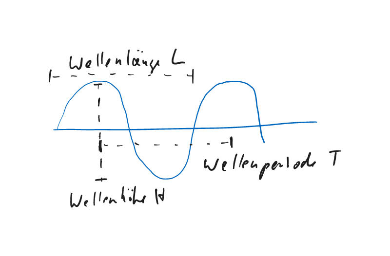

2. **Signifikante Wellenhöhe**

Ist die Wellenhöhe die BSH und DWD in ihren Berichten und Vorhersagen angeben. 

H~1/3~ = mittlere Wellenhöhe aus dem Drittel der höchsten Wellen eines Seegangs

=> Es gibt hohe, mittelhohe und niedrige Wellen 

>Seegangshöhen in Europa werden in der Regel in Wetterberichten in Meter (m) angegeben. Die Seegangshöhe bezieht sich auf die durchschnittliche Höhe der höchsten Drittel der Wellen und wird oft als signifikante Wellenhöhe bezeichnet. Es ist jedoch wichtig zu beachten, dass die tatsächlichen Bedingungen auf See von vielen Faktoren abhängen, wie z.B. Windgeschwindigkeit, Wassertiefe und Strömungen, und dass es immer ratsam ist, spezifische Informationen von lokalen Wetterdiensten oder Behörden einzuholen, bevor man auf See geht.

> In Seehandbüchern, Seegangskarten und Wetterberichten wird stets die signifikante Wellenhöhe angegeben.

3. In den Seehandbüchern findet sich bei den Seegangsangaben stets der Zusatz, dass in einem Seegangsfeld höhere Wellen als die angegebene signifikante Wellenhöe auftreten. 

4. Entsprechend der Bft-Skala gibt es eine **Seegangsskala** nach den Seegangsstärken von 0 bis 9. 

5. **Grobe See**

Windgeschwindigkeit: 6 Bft oder 24 kn 
Wellenhöhe: 2,5 - 4 

6. Höhe des Seegangs hängt ab von 

- **Wirkstärke** der Welle
- **Wirkdauer** der Welle
- **Wirkweg** (Fetch) der Welle

7. Seegang ist ausgereift, wenn größere Wirkdauer sich nur bei einer höheren Wirkstrecke auswirkt.

8. **Windsee und Dünung**

Windsee: Die Windsee ist der Anteil des Seegangs, der unmittelbar vom Wind angetrieben wird.

>Windsee ist Seegang, der durch den Wind am Ort oder in der näheren Umgebung angefacht wird. Windsee hängt ab von:
Windgeschwindigkeit, Fetch (Windwirklänge) und Wirkdauer des Windes.

Die Wellenbewegung ist ein Schwingungszustand, der sich schneller ausbreitet, als das ihn hervorrufende Windfeld ziehen kann. 

Dünung: Es läuft also eine See aus dem Windfeld heraus, ohne von dem Wind weiter bearbeitet zu werden. 

Kreuzsee: Es überlagern sich Wellenzüge aus verschiedenen Richtungen

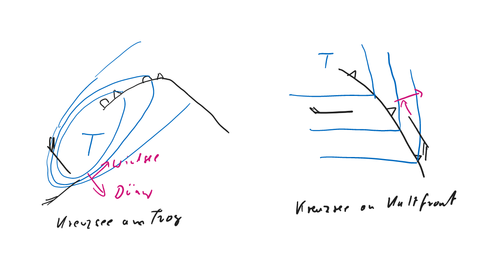

>Kreuzseen entstehen, wenn Wellen aus verschiedenen Richtungen aufeinandertreffen und sich kreuzen. Kreuzseen bewirken, dass die Wellen aus verschiedenen Richtungen auf die Yacht treffen, was zu einem instabilen Schwanken und Rollen führen kann. Wenn die Yacht nicht ausreichend stabilisiert ist, kann es zu Schäden am Rumpf oder anderen Teilen kommen. Im schlimmsten Fall kann die Yacht kentern und es besteht eine erhebliche Gefahr für die Besatzung. Es ist daher wichtig, in Kreuzseen vorsichtig zu sein und immer eine gute Seemannschaft zu praktizieren, um das Boot stabil zu halten und Unfälle zu vermeiden. Kreuzseen können in vielen Gewässern auftreten, insbesondere in Küstengewässern mit hohem Wellengang und starkem Wind. Sie treten oft auf, wenn eine Welle von einem Sturm oder starken Winden in eine andere Welle oder eine Strömung gerät, die aus einer anderen Richtung kommt. In Küstennähe können Kreuzseen auch durch die Reflektion von Wellen an Ufermauern, Klippen oder anderen Hindernissen entstehen. Es ist wichtig zu beachten, dass Kreuzseen nicht immer vorhersehbar sind und plötzlich auftreten können, insbesondere bei schwierigen Wetterbedingungen. Daher ist es wichtig, die Wetterbedingungen und die Gewässerbedingungen zu berücksichtigen und immer eine gute Seemannschaft zu praktizieren, um das Boot stabil zu halten und Unfälle zu vermeiden.

9. In einer Meereswelle verläuft die Bewegung der Wasserteilchen kreisförmig.

10. Einteilung der Wellen

WT = Wassertiefe
L = Wellenlänge

$$Oberflächenwellen: WT < \frac{L}{2}$$ 
$$Grundsee: WT > \frac{L}{2} $$ 
$$Brandung:  \frac{H}{L} \ge  \frac{1}{8} $$ 
Wellensteilheit H/L > 1/7 und Grundsee => Brandung
 
>Man spricht allgemein von einer Grundsee, wenn eine Welle aufgrund ihrer Länge auf flachem Wasser vom Meeresboden beeinflusst werden. Die Wellen werden abgebremst, die Wellenlänge dadurch verkürzt und die Welle aufgesteilt. Es kommt zum Überbrechen der steilen Wellen. Ursache: Wenn relativ lange und verhältnismäßig hohe Wellen aus tieferem Wasser in Gebiete mit geringer Wassertiefe, also z.B. der Nordsee, einlaufen, so kommt es zur Störung der kreisförmigen (schleifenförmigen) Orbitalbewegung der Wasserteilchen durch „Grundberührung“, die Orbitalbewegung wird abgebremst. Die ursprüngliche Kreisbewegung nimmt eine stak elliptische Form an, dies führt zur Destabilisierung der Wellen. Die Brechung von Meereswellen setzt dann ein, wenn die Orbitalbewegung der Wasserteilchen in den Wellenkämmen größer als die Wellengeschwindigkeit ist (theoretisch ist das der Fall, wenn die Wellenhöhe 1/7 der Wellenlänge übersteigt). Entstehung durch Untiefen oder in Küstennähe. Eine Grundsee kann etwa das 2,5 fache der signifikanten Wellenhöhe erreichen.
 
11. "Fühlt" eine Welle in flachem Wasser den Boden, dann ändern sich ihre Geschwindigkeit und ihre Richtung. Bei geringer Wassertiefe laufen sie langsamer. Dies bewirkt bei einer langen Wellenfront zusätzlich eine Drehung, wenn ein Teil der Front sich in tiefem, der andere Teil sich in flachem Wasser ausbreitet. 

=> Bänke immer an Luvseite umfahren, da hinter der Bank sich Kreuzseen bilden können. 

# Seewetterinformation

1. Wetterberichte

|Herausgeber|Gültigkeit|Inhalte|
|-----------|----------|-------|
|Bundesamt für Seeschiffhart und Hydrographie (BSH)|Europäische Gewässer|Stationen, Vorhersagegebiete und Frequenzen|
|Deutscher Wetterdienst|Weltweit|vielfältige Wetterinformationen, Sturmwarnungen und Seewetterberichte für die Sport- und Küstenschiffahrt|

2. Quellen für Seewetterberichte in Klartext

- UKW-Küstenfunkstellen von DP07  
- Wetterfunksender des DWD Offenbach/Pinneberg  
- Rundfunksender  
  - Deutschlandfunk (DFL)
  - Deutshclandradio Kultur
  - Norddeutscher Rundfunk INFO
- Meteorologischer Hafendienst
- Videotext
- Revierzentralen
- Internet
- SEEWIS-online, SEEWIS-Fax
- Privater Informationsdienst (PID) der Deutschen Telekom
- private Beratung des DWD
- NAVTEX Inhalte und Vorhersage

>Wetterinformationen an Bord erhältlich über
- Hörfunksender (UKW, KW, MW, LW) 
- Küstenfunkstellen, 
- Verkehrszentralen, 
- NAVTEX, 
- Online- Dienste (z.B. Seewis- Online des Deutschen Wetterdienstes, T-Online, u.a.), 
...weitere...
- RTTY (Funkfernschreiben), 
- Faksimile (Wetterfax), 
- Faxpolling (z.B. SEEWIS-Fax des Deutschen Wetterdienstes),
- Telefonabruf, Törnberatung

3. Für die europäischen Meeresgebiete stehen Wetterinformationen hinsichtlich Inhalte und Vorhersagezeiten in Klartexten und Karten zur Verfügung.

4. Verbreitung von Wettermeldungen im Bereich des GMDSS (Global Maritime Distress and Safety System, Weltweites Seenot- und Sicherheitssystem)

Die Weltmeere wurden in 21 Gebiete, die so genannten [METAREAS](https://wwmiws.wmo.int/), unterteilt, um meteorologische Informationen und Dienste für die Schifffahrt bereitzustellen.

5. Ideale Wetterkarte

Vorhersagen von 00,12,24,36,48,60,72 Stunden mit
- allen Druckgebieten und Isobaren    
- Fronten und ähnlichen Gebilden   
- Winden in Stärke und Richtung  
- Windsee - Höhe und Richtung  
- Dünung - Höhe und Richtung
- Strömungen
- Wasserstände

# Verarbeitung von Seewetterberichten

1. Möglichkeiten einen Seewetterbericht zu zeichnen

- Angaben Wetterbericht mit Abkürzungen eintragen und Fronten einzeichnen => Hilfspunkte mit Druckangaben markieren => Isobaren einzeichnen
- Stationsmeldungen  => Angaben des Wetterberichtes => Hilfspunkte => Isobaren
- Trogachsen und Hochkeilachsen einzeichnen (Aus Zeitgründen und weil im Mittelmehr 5er Isobaren aufgrund geringer Druckunterschiede keinen Sinn ergeben)

2. Unterlagen und Regeln zum Zeichnen von Wetterberichten

- Unterlagen: Vordrucke [Bordwetterkarte 9 (Nord- und Ostsee) und 11 (Mittelmeer)](https://www.dwd.de/DE/leistungen/lehrmittel/bordwetterkarte_nr9.html), [Seewetterbericht mit geographischen Namen](http://www.well-sailing.de/fileadmin/dateien-richard/SSS_Wetter/OK-Begriffe-Seewetterberichte-2013.pdf)

- Regeln: 
  - Isobaren im Abstan 5 zu 5 hPa (in England 4 zu 4 hPa)
  - Isobaren sind glatte Linien mit Knick an Fronten und meist weg vom Tief
  - Isobaren können sich niemals berühren, schneiden oder gabeln
  - Nie Isobaren auslassen oder zusätzlich einschalten

=> Isobaren so zeichnen, dass auf See ein Winkel von 22 Grad (über Land mehr) zwischen ihnen und der Windrichtung entsteht. **Fähnchen zeigen auf der Nordhalbkugel immer zur linken Seite**. => tiefe Druck ligt, in Windrichtung geschaut, links.

3. Symbole für vereinfachtes Stationsmodell, siehe [Boardwetterkarte](https://www.dwd.de/DE/leistungen/lehrmittel/bordwetterkarte_nr9.html)

4. Seewetterberichte Nord- und Ostsee z. B.über Deutschlandfunk (Frequenz 1269 hHz, Sendezeiten 0105, 0640 und 1105)

Internetseite: [https://www.deutschlandfunk.de/](https://www.deutschlandfunk.de/)

>Veröffentlichungen mit Sendezeiten und Frequenzen für Seewetterberichte:  
- Amtlich: Der „Nautische Funkdienst Band 2“ (Funkordnung, Wetter- und Eisfunk) und der „Jachtfunkdienst Nord- und Ostsee“ des BSH, sowie die angelsächsische Veröffentlichung „Admiralty List of Radio Signals Volume 3“.  
- Nicht-amtlich: „Sturmwarnungen und Seewetterberichte für die Sport- und Küstenschifffahrt“ des Deutschen Wetterdienstes (DWD).

5. Vorschlag zur Gliederung von Wetterinformationen:

- Großwetterlage  
- Wettervorhersage für das Fahrgebiet  
- Streckenwetter für den Törn  

6. Bedeutung der Kenntnis der Großwetterlage

seemännische Sorgfaltspflicht => rechtliche/versicherungsrechtliche Bedeutung

7. Navi/Vorhersagebereich/Wetterbericht

|meteorologische Navigation|Vorhersagebereich|Seewetterbericht|
|--------------------------|-----------------|----------------|
|Wetternavigation|Nowcasting Kürzestfristvorhersage Korsfristvorhersage|Beschreibung des gegenwärtigen Wetters (Stationsmeldungen) einige Windvorhersagen Seewetterberichte|
|Witterungsnavigation|Mittelfristvorhersage|Mittelfristseewetterbericht für die nächsten 5 Tage|
|Klimanavigation|Langfristvorhersage|-|

8. Prognose aus Wetterberichten zeichnen
 
9. **Streckenwetterberichte** beschreiben das Wetter auf bestimmten Strecken.

10. Eigene Interpretation der Wetterlage bei kritischen Wetterlagen

=> Bei wechselhaftem Wetter mit schnell ziehenden Tiefs und Fronten => u. U. Interpolation zwischen Analyse und Vorhersage

Auch wenn - großräumig gesehen - die Wetterlage sehr gut vorhergesagt wird, kann es - kleinräumig gesehen - erhebliche regionale Abweichungen von den Vorhersagen geben. => Seehandbücher als nützliche Hilfen

11. Aufbau Seewetterkundliche Prüfliste

- Großräumige Wetterlage
  - steuernde Druckgebiete
  - Luftmassen
  - wandernde Hochs, Tiefs, Keile
  
- Kleinräumige Wetterlage auf der Route von/nach
 - Wind-, Sturmwarnungen
 - Windstärkeveränderungen
 - Fronten
 - Windrichtungsveränderungen
 - Böhigkeit
 - Niederschläge
 - Sicht (Nebel)
 - Vereisung
 - Windsee
 - Dünung
 - [Kreuzsee](/post/wetterkunde/#seegang)
 - Oberlächenströmung
 - See und Strom (Gezeiten)
 - See und Untergrund
 - [Winde an Gebirgen](/post/wetterkunde/#regionale-wettererscheinungen)
 - [Regionale Winde](/post/wetterkunde/#regionale-wettererscheinungen) 
 - Eis
 - optische Besonderheiten

- Wetternavigatorische Maßnahmen
  - Nothafen
  - Umwege zur Vermeidung von Gefahren
  - Alternativrouten
  
12. Die Auswertung der Wetterkarten aus navigatorischer Sicht fällt in der BEreich der **meteorologischen Navigation**. Deren Aufgabe besteh vorzugsweise in

- Sicherheit gewährleisten  
- Beanspruchung des Schiffes begrenzen  
- Reise nach persönlichen Vorlieben gestalten  

13. Beispiele zur meteorologischen Navigation

- Meiden von Gefahrengebieten  
- Vorsicht bei kreuzen der Zugbahn eines Sturmgebietes
- Kurse gegen den Wind und See möglichst meiden
- Bei der Kurswahl auf bevorstehende Windrichtungsänderungen achten

# Meteorologische Geräte

1. Grundsätzliche Funktionsteile von Messgeräte

- Messwertgeber  
- Messwertwandler  
- Messwertübertrager  
- Messertanzeige  

2. Um bei einem Barometer die **Drucktendenz** festzuhalten, muss der Druck regelmäßig, üblicherweise zweistündlich, abgelesen und aufgeschrieben werden. => Logbucheintrag nit einfachen Wetterzeichen. 

3. Aus **Barographenkurfen (Barogramme)**, kann der absolute Druck zu jedem bestimmten Zeitpunkt abgelesen werden => Tendenz und Geschwindigkeit der Druckveränderung => nachträgliche Auswertung (hindcasting) möglich

4. Mit einem Barogramm kann neben anderen Informationsquelen die Weiterentwicklung des Wetters abgelesen werden.  

5. **Windmesser (Anemometer)** bestehen aus 

- Windgeschwindigkeitsmesser und   
- Windrichtungsanzeiger. 

Windmessanlage besteht aus Windfahne(Richtung) und Schalenkreuz(Geschwindigkeit) => Messung erfolgt mit berührungslosen Induktiv- und Hallsensoren. 

6. Wenn das Schiff Fahrt macht, zeigt der Windmesser den scheinbaren Wind an. Bei Koppelung mit Navigationssensoren auch wahren Wind etc.

7. Lufttemperatur wird gemessen mit 

- Flüssigkeitsthermometern  
- Bimetalstreifen  
- elektronische Temoperaturfühler  

8. Luftfeuchte wird mit Hygrometer gemessen über

- mechanische Geräte die feuchtigkeitsabhängig Längendehnung bestimmter Haararten oder die Verformung speziell beschichteter Metalle nutzen.  
- elektrische Feuchtemessverfahren 

